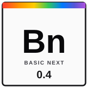

# Basic Next



[](#)
[](#)
[](LICENSE.md)

An object-oriented, general-purpose programming language designed to reduce
cognitive load and turn ideas into clear, cross-platform software.

Basic Next combines BASIC-inspired readability, explicit types, and host
capabilities without prescribing a framework or architecture. It is designed
to make programming pleasurable: clear, predictable code should help
programmers sustain attention and enter a state of flow while reading and
writing software.

This repository starts with the specification: an implementation is introduced
only after the corresponding semantics have been defined and reviewed.

## Design goals

- Readability before abbreviation.
- Low cognitive load, flow by clarity, and explicit contracts.
- KISS: complexity must solve a concrete problem.
- Every `LET` and `CONST` declaration states its type explicitly.
- Clean Code and Clean Architecture should be natural, never mandatory.
- Cross-platform software through `HOST` capabilities rather than vendor APIs.

Read [PHILOSOPHY.md](PHILOSOPHY.md) for the mission, vision, and complete set
of design principles.

## 🚀 Status: Version 0.4.3 development

The Basic Next 0.4.3 release extends the Rust reference frontend, typed IR
interpreter, HOST capabilities, external BN modules, HTTP hardening, bounded
async runtime, debugger bridge, and notebook tooling. Read the
[0.4.2 release notes](done/0.4.2-release-news.md) for the complete summary.
BNDispatch native-provider conformance includes the 0.4.3 lifecycle,
synchronization, isolation, and networking corrections; see the [recovery
design](docs/superpowers/specs/2026-09-02-bndispatch-recovery-design.md).
The active [`ongoing/bucket.md`](ongoing/bucket.md) records the delivery gates;
the archived 0.2 program remains in [`archive/project/bucket-0.2.md`](archive/project/bucket-0.2.md).

> **Note:** `bn build` is available for its supported typed-IR subset. The
> interpreter remains the reference implementation for language surfaces
> outside that subset.

## 🎯 Active implementation

The Basic Next reference implementation is a source-spanned lexer, handwritten recursive-descent/Pratt parser, syntax AST, semantic analyzer, typed BN IR, deterministic IR interpreter, and initial LLVM emitter. It provides:

- `bn check file.bn` — Accepts valid fixtures and reports precise, source-spanned diagnostics for errors.
- `bn run file.bn [-- args...]` — Validates and immediately executes the accepted interpreter surface.
- `bn build [--target native|wasm32] file.bn` — Emits LLVM IR, or an artifact with `-o`, for the supported compiler subset.

See the [0.4.2 release notes](done/0.4.2-release-news.md), [active release bucket](ongoing/bucket.md),
[0.4 conformance evidence](ongoing/0.4-conformance.md),
[archived 0.2 remediation program](archive/project/bucket-0.2.md), and
[0.4 contract](docs/language/0.4/0.4.md) for delivery status and accepted semantics.

To see under the hood, try:
- `bn check -v file.bn` (reports completed stages)
- `--emit ast`, `--emit typed-ast`, or `--emit ir` (emits frontend artifacts)

## 🛠️ Getting Started

`BN` is the official Basic Next tool, invoked as `bn`. It provides `bn check`,
`bn run`, and `bn build`; the commands share one diagnostic format, source
locations, and exit-code model.

### Quick Installation

**1. For Users (Direct Download)**
The easiest way to get started is to download the pre-compiled binary for your operating system (Linux, macOS, Windows) directly from [GitHub Releases](https://github.com/cquintella/BasicNext/releases/latest). 
The asset names and checksums are listed in [`binaries/README.md`](binaries/README.md).

**2. For Developers (Build from Source)**
If you prefer building from source and have Rust (1.97+) installed, you can install the CLI from this repository:
```shell
cargo install --path .
```

Usage, limits, and troubleshooting: [`docs/project/usage.md`](docs/project/usage.md).
Unix manual: [`bn(1)`](docs/man/bn.1) (`man docs/man/bn.1`).

The trivial case is zero-config: `bn run hello.bn` does not require a project
file or manifest. While developing from this repository, use:

```shell
cargo run -- run examples/hello.bn
cargo run -- run examples/language-tour.bn
cargo run -- check --emit ir examples/factorial.bn
cargo run -- --help
```

Release check from a clean tree:

```shell
cargo fmt --check && cargo test && cargo clippy --all-targets -- -D warnings && git diff --check
```

Requires Rust 1.97. Current limitations include partial LLVM lowering;
`TIMEZONE` does not apply zone rules. Linked wasm32 modules run through
`node bin/bn-wasm`. See `archive/project/bucket-0.2.md` for the archived 0.2
remediation work and `archive/project/bucket-0.2.md` for its historical defect inventory.

`config.toml` contains local tool configuration. Currently it selects the
`clang` command used by `bn build`; it does not alter language semantics.

## 📂 Repository layout

- `docs/book/en/` — English language tutorial ([toc](docs/book/en/toc.md)).
- `docs/language/0.2/` — accepted 0.2 language contract; `0.1/` is frozen.
- `todo/proposals/` — proposals not yet fully accepted.
- `done/proposals/` — accepted proposals kept for history.
- `docs/man/bn.1` — Unix man page for the `bn` tool.
- `docs/project/` — delivery planning, [usage](docs/project/usage.md), and the
  [experience contract](docs/project/experience-contract.md).
- `binaries/` — download index for prebuilt `bn` (binaries live on Releases).
- `examples/` — programs that guide the specification.
- [`examples/parallel-examples.md`](examples/parallel-examples.md) — bounded
  `BNDispatch` examples, including a parallel Leibniz-series pi calculation.
- `plugins/jupyter/` — installable Python Jupyter kernel host.
- `plugins/vscode/` — VS Code extension and its tests.
- `PHILOSOPHY.md` — design principles.
- `GOVERNANCE.md` — how decisions are made.
- `TRADEMARK.md` — use of the project name.

## ✨ Example (Hello World)

Basic Next is straightforward and designed for immediate readability ("Readable by design"):

```basic
FUNCTION Start() AS VOID
    PRINT "Bem Vindo ao Basic Next"
    LET counter AS INTEGER = 0

    WHILE counter < 10
        PRINT "Basic Next", counter
        counter += 1
    END WHILE
END FUNCTION
```

**Line by line explanation:**
- `FUNCTION Start() AS VOID` or `FUNCTION Start() AS INTEGER`: Every executable program begins with the `Start` function. LLVM emits an integer return as the process exit code; the interpreter supports both forms.
- `PRINT "Bem Vindo ao Basic Next"`: The built-in macro outputs text to the console.
- `LET counter AS INTEGER = 0`: Variable declarations are explicit (`LET`), always specify their type (`AS INTEGER`), and initialize their state.
- `WHILE counter < 10`: A standard loop with a clear pre-condition.
- `PRINT "Basic Next", counter`: `PRINT` can concatenate multiple expressions transparently.
- `counter += 1`: Safe, standard arithmetic mutation.
- `END WHILE` and `END FUNCTION`: Blocks are explicitly closed with named `END` statements, avoiding ambiguity and dangling braces.

*Check out `examples/language-tour.bn` for a complete demonstration of the language capabilities!*

---

“Basic Next é interessante quando tenta tornar explícitas as estruturas que outras linguagens escondem: tipos, escopo, memória, módulos, capacidades do host. Isso tem valor pedagógico e científico. Mas uma linguagem não se justifica por ser uma lista crescente de mecanismos; ela se justifica por revelar uma estrutura simples capaz de gerar muitas expressões úteis.”


## 🤝 Contributing
Read [CONTRIBUTING.md](CONTRIBUTING.md). Language evolution begins as proposals
in `todo/proposals/`; specification changes require examples.

## ❤️ Support
See [SPONSORSHIP.md](SPONSORSHIP.md) to support Basic Next maintenance without
interfering with its technical governance.

## 📄 License
[MPL 2.0](LICENSE.md).
