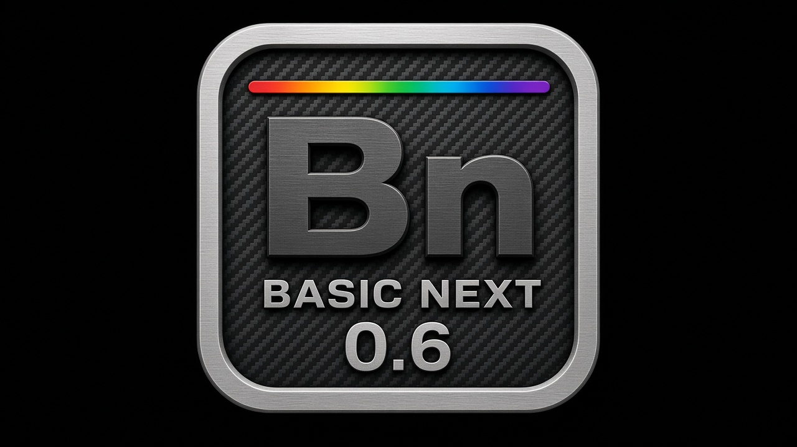

# Basic Next



[](#)
[](#)
[](LICENSE.md)

---

An object-oriented, general-purpose programming language designed to reduce
cognitive load and turn ideas into clear, cross-platform software.

---

Basic Next combines BASIC-inspired readability, explicit types, and host
capabilities without prescribing a framework or architecture. It is designed
to make programming pleasurable: clear, predictable code should help
programmers sustain attention and enter a state of flow while reading and
writing software.

## Name

**Basic Next** (two words) is the language name. **BasicNext** is the repository
and package identifier.

This project is **not** [NextBASIC](https://wiki.specnext.dev/NextBASIC), the
extended Sinclair BASIC that ships with the
[ZX Spectrum Next](https://www.specnext.com/).

The `bn` tool is both an interpreter and an LLVM-backed compiler for Basic Next
programs:

- `bn run` — validate, lower to BN IR, and interpret
- `bn build` — compile the supported IR subset to a native or Wasm artifact
- `bn eval` — evaluate a source fragment (argument or `--stdin`) without a temp file
- `bn check` / `bn lex` / `bn lsp` / `bn dap` — check, lex, language server, debugger

## Design goals

- Readability before abbreviation.
- Low cognitive load, flow by clarity, and explicit contracts.
- KISS principle: complexity must solve a concrete problem.
- Every `LET` and `CONST` declaration states its type explicitly.
- Clean Code and Clean Architecture should be natural, never mandatory.
- Cross-platform software through `HOST` capabilities rather than vendor APIs.

Read [PHILOSOPHY.md](PHILOSOPHY.md) for the mission, vision, and complete set
of design principles.

## 🚀 Status: Version 0.5.1 (0.5.2 closed in-tree)

**Latest GitHub release:** [v0.5.1](https://github.com/cquintella/BasicNext/releases/tag/v0.5.1).
Bucket **0.5.2** is closed in-tree (qualified import, `PROTECTED` / `OVERRIDE`,
static factories, `++` / `--`); GitHub tag/binaries for 0.5.2 follow when cut.
Release notes: [`docs/releases/`](docs/releases/README.md).

The tutorial book under `docs/book/en/` tracks the 0.5 line.


## 🛠️ Getting Started

`BN` is the official Basic Next tool, invoked as `bn`. It provides `bn check`,
`bn run`, and `bn build`; the commands share one diagnostic format, source
locations, and exit-code model.

### Quick Installation

**1. One-line install (Linux / macOS)**
No checkout and no Rust required. The command downloads `scripts/install.sh`,
which resolves the latest release, fetches the prebuilt `bn`/`bnc` for your
OS/architecture (verified against the release's `SHA256SUMS`) together with the
standard-library modules, diagnostics catalog and man page from the same tag,
and installs everything under one prefix. If the release has no binary for your
platform, it builds from that tag's sources with `cargo` instead.

```shell
curl -fsSL https://raw.githubusercontent.com/cquintella/BasicNext/main/scripts/install.sh | bash
# user-local, no sudo:
curl -fsSL https://raw.githubusercontent.com/cquintella/BasicNext/main/scripts/install.sh | PREFIX="$HOME/.local" bash
# custom prefix, or a pinned version:
curl -fsSL https://raw.githubusercontent.com/cquintella/BasicNext/main/scripts/install.sh | bash -s -- --prefix /opt/basicnext
curl -fsSL https://raw.githubusercontent.com/cquintella/BasicNext/main/scripts/install.sh | BN_VERSION=v0.5.1 bash
```

**2. Install script from a checkout**
Inside a clone, the same scripts build `bn` and `bnc` from source and place the
binaries plus the runtime files they need (standard-library `.bn` modules,
diagnostics catalog, and the Unix man page) in a single prefix. `bn` then
discovers its modules and catalog by walking upward from its own location —
zero configuration afterwards.

Linux / macOS (installs to `/usr/local`, uses `sudo` only if that prefix is not
writable):
```shell
./scripts/install.sh
# user-local, no sudo:
PREFIX="$HOME/.local" ./scripts/install.sh
# custom prefix:
./scripts/install.sh --prefix /opt/basicnext
```

Windows (PowerShell; installs to `%LOCALAPPDATA%\Programs\BasicNext` and adds it
to your user `PATH`, no admin needed):
```powershell
powershell -ExecutionPolicy Bypass -File scripts\install.ps1
# custom prefix:
powershell -ExecutionPolicy Bypass -File scripts\install.ps1 -Prefix C:\Tools\BasicNext
```

Installed layout (FHS):

| Path | Contents |
| --- | --- |
| `<prefix>/bin/bn`, `<prefix>/bin/bnc` | executables |
| `<prefix>/share/bn/modules/bn/*.bn` | standard-library modules |
| `<prefix>/share/bn/diagnostics/en-US/*.ftl` | diagnostics catalog (optional — an identical catalog is embedded) |
| `<prefix>/share/man/man1/bn.1` | Unix manual page (Linux/macOS) |

Each script verifies the install by running `bn --version` and resolving a
standard-library module from a clean directory. Pass `--no-build` (Bash) or
`-NoBuild` (PowerShell) to install already-built `target/release` binaries.

**3. For Users (Direct Download)**
Alternatively, download the pre-compiled binary for your operating system (Linux, macOS, Windows) directly from [GitHub Releases](https://github.com/cquintella/BasicNext/releases/latest).
The asset names and checksums are listed in [`binaries/README.md`](binaries/README.md).

**4. For Developers (Build from Source)**
If you prefer building from source and have Rust **1.98** installed (see `rust-toolchain.toml`), you can install the CLI from this repository:
```shell
cargo install --path .
```
Note that `cargo install` places only the binary on your `PATH`; use the install
script above if you also want the stdlib modules and catalog on disk.

Usage, limits, and troubleshooting: [`docs/project/usage.md`](docs/project/usage.md).
Unix manual: [`bn(1)`](docs/man/bn.1) (`man docs/man/bn.1`).

The trivial case is zero-config: `bn run hello.bn` does not require a project
file or manifest. While developing from this repository, use:

```shell
cargo run --bin bn -- run examples/hello.bn
cargo run --bin bn -- run examples/language-tour.bn
cargo run --bin bn -- run examples/filesystem_tour.bn
cargo run --bin bn -- run examples/bnlog_tour.bn
cargo run --bin bn -- eval 'PRINT 1 + 1'
cargo run --bin bn -- check --emit ir examples/factorial.bn
cargo run --bin bn -- --help
```

Release check from a clean tree:

```shell
cargo fmt --check && cargo test && cargo clippy --all-targets -- -D warnings && git diff --check
```

Requires Rust **1.98** (`rust-toolchain.toml`). Current limitations include partial LLVM lowering;
`TIMEZONE` does not apply zone rules. Linked wasm32 modules run through
`node bin/bn-wasm`.

`config.toml` contains local tool configuration. Currently it selects the
`clang` command used by `bn build`; it does not alter language semantics.

## 📂 Repository layout

- `docs/book/en/` — English language tutorial ([toc](docs/book/en/toc.md)).
- `docs/language/0.5/` — **normative** 0.5.x language contract ([`0.5.md`](docs/language/0.5/0.5.md), EBNF, keywords). Older `0.2/`–`0.4/` trees remain historical.
- `todo/proposals/` — proposals not yet fully accepted.
- `done/` — closed buckets and accepted proposal history (often local / gitignored).
- `docs/man/bn.1` — Unix man page for the `bn` tool.
- `docs/project/` — delivery planning, [usage](docs/project/usage.md), and the
  [experience contract](docs/project/experience-contract.md).
- `binaries/` — download index for prebuilt `bn` (binaries live on Releases).
- `examples/` — programs that guide the specification (see below).
- [`examples/parallel-examples.md`](examples/parallel-examples.md) — bounded
  `BNDispatch` examples, including a parallel Leibniz-series pi calculation.
- Editor support: [basicnext-vscode](https://github.com/cquintella/basicnext-vscode)
  (standalone VS Code extension; Jupyter kernel is also a separate repository).
- Jupyter kernel — separate repository: [cquintella/basicnext-jupyter](https://github.com/cquintella/basicnext-jupyter).
- VS Code extension — separate repository: [cquintella/basicnext-vscode](https://github.com/cquintella/basicnext-vscode).
- `PHILOSOPHY.md` — design principles.
- `GOVERNANCE.md` — how decisions are made.
- `TRADEMARK.md` — use of the project name.

## ✨ Example (Hello World)

Basic Next is straightforward and designed for immediate readability ("Readable by design"):

```basic
FUNCTION Start() AS VOID
    PRINT "Bem Vindo ao Basic Next"
    LET counter AS INTEGER = 0

    WHILE counter < 10
        PRINT "Basic Next", counter
        counter += 1
    END WHILE
END FUNCTION
```

**Line by line explanation:**
- `FUNCTION Start() AS VOID` or `FUNCTION Start() AS INTEGER`: Every executable program begins with the `Start` function. LLVM emits an integer return as the process exit code; the interpreter supports both forms.
- `PRINT "Bem Vindo ao Basic Next"`: The built-in macro outputs text to the console.
- `LET counter AS INTEGER = 0`: Variable declarations are explicit (`LET`), always specify their type (`AS INTEGER`), and initialize their state.
- `WHILE counter < 10`: A standard loop with a clear pre-condition.
- `PRINT "Basic Next", counter`: `PRINT` can concatenate multiple expressions transparently.
- `counter += 1`: Safe, standard arithmetic mutation.
- `END WHILE` and `END FUNCTION`: Blocks are explicitly closed with named `END` statements, avoiding ambiguity and dangling braces.

### Examples worth running

| Program | Focus |
| --- | --- |
| [`examples/hello.bn`](examples/hello.bn) | Minimal `Start` |
| [`examples/language-tour.bn`](examples/language-tour.bn) | Broad language surface |
| [`examples/filesystem_tour.bn`](examples/filesystem_tour.bn) | `HOST.FileSystem` write / read / close |
| [`examples/bnlog_tour.bn`](examples/bnlog_tour.bn) | `BNLog` console + file transports |
| [`examples/bnstring_tour.bn`](examples/bnstring_tour.bn) | `BNString` |
| [`examples/bndata_tour.bn`](examples/bndata_tour.bn) | `BNData` + CSV via FileSystem |
| [`examples/exec-demo.bn`](examples/exec-demo.bn) | `HOST.Exec` (when present in tree) |
| [`examples/socket.bn`](examples/socket.bn) | `HOST.Net` TCP/UDP |

Prefer `cargo run --bin bn -- run …` from a checkout so you use this tree’s
toolchain (a globally installed `bn` may lag behind `main`).

---

“Basic Next é interessante quando tenta tornar explícitas as estruturas que outras linguagens escondem: tipos, escopo, memória, módulos, capacidades do host. Isso tem valor pedagógico e científico. Mas uma linguagem não se justifica por ser uma lista crescente de mecanismos; ela se justifica por revelar uma estrutura simples capaz de gerar muitas expressões úteis.”


## 🤝 Contributing
Read [CONTRIBUTING.md](CONTRIBUTING.md). Language evolution begins as proposals
in `todo/proposals/`; specification changes require examples.

## ❤️ Support
See [SPONSORSHIP.md](SPONSORSHIP.md) to support Basic Next maintenance without
interfering with its technical governance.

## 📄 License
[MPL 2.0](LICENSE.md).
