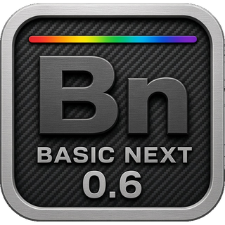

# Basic Next

<p align="center">
  
</p>

[](https://github.com/cquintella/BasicNext/actions/workflows/ci.yml)
[](https://github.com/cquintella/BasicNext/releases/latest)
[](LICENSE.md)

An object-oriented, general-purpose programming language designed to reduce
cognitive load and turn ideas into clear, cross-platform software.

Basic Next combines BASIC-inspired readability, explicit types, and host
capabilities without prescribing a framework or architecture. Clear,
predictable code should help programmers sustain attention and enter a state
of flow while reading and writing software.

**Basic Next** (two words) is the language; **BasicNext** is the repository
and package identifier. It is not
[NextBASIC](https://wiki.specnext.dev/NextBASIC), the extended Sinclair BASIC
of the [ZX Spectrum Next](https://www.specnext.com/).

## Hello World

```basic
FUNCTION Start() AS VOID
    PRINT "Welcome to Basic Next"
    LET counter AS INTEGER = 0

    WHILE counter < 10
        PRINT "Basic Next", counter
        counter += 1
    END WHILE
END FUNCTION
```

- `FUNCTION Start()`: every program begins here. `Start` returns `VOID` or
  `INTEGER`; an `INTEGER` becomes the process exit status.
- `PRINT "Basic Next", counter`: prints its values separated by a space.
- `LET counter AS INTEGER = 0`: a variable states its type and starts with a
  value.
- `counter += 1`: integer arithmetic is checked; overflow stops the program
  with a diagnostic instead of wrapping.
- `END WHILE`, `END FUNCTION`: each block closes with a named `END`.

## Design goals

- Readability before abbreviation.
- Low cognitive load, flow by clarity, and explicit contracts.
- KISS: complexity must solve a concrete problem.
- Explicit types: every variable states its type; a constant may take it from
  its literal.
- Clean Code and Clean Architecture should be natural, never mandatory.
- Cross-platform software through `HOST` capabilities rather than vendor APIs.

[PHILOSOPHY.md](PHILOSOPHY.md) holds the mission, vision, and complete set of
design principles.

## Toolchain

Two executables share one frontend, one diagnostic format, and one exit-status
model:

- `bni` interprets and hosts the tools: `run`, `eval`, `check`, `lex`, `lsp`
  (language server), and `dap` (debugger).
- `bnc` compiles to a native executable or WebAssembly through LLVM:
  `bnc hello.bn` (or `bnc hello.bn -o hello`). `bnc -g` adds debug information
  (DWARF; a PDB on Windows).

A program needs no project file: `bni hello.bn` or `bnc hello.bn` is enough. The manuals are
[`bni(1)`](man/bni.1) and [`bnc(1)`](man/bnc.1).

## Installation

**Linux / macOS**

```shell
curl -fsSL https://raw.githubusercontent.com/cquintella/BasicNext/main/scripts/install.sh | bash
```

The script asks for a prefix (`$HOME/basicnext`, `/opt/basicnext`,
`/usr/local`, or another path), then installs the latest release's `bni` and
`bnc` (checksum-verified), the standard-library modules, the diagnostics
catalog, and the man pages. It uses `sudo` only when the prefix is not
writable, and builds from source with `cargo` when the release has no binary
for your platform. Skip the menu with `--prefix DIR`; pin a release with
`BN_VERSION=v0.6.4`. The install writes `$HOME/.basicnext/uninstall.sh`.

**Windows (PowerShell)**

```powershell
irm https://raw.githubusercontent.com/cquintella/BasicNext/main/scripts/install.ps1 | iex
```

The script installs to `%LOCALAPPDATA%\Programs\BasicNext` without administrator
rights, or to `$env:BN_PREFIX`. It downloads the latest release's `bni.exe`,
`bnc.exe`, and `bn_rt.lib` (checksum-verified against `SHA256SUMS`), the
standard-library modules, and the diagnostics catalog, updates the user `PATH`,
and writes `%USERPROFILE%\.basicnext\uninstall.ps1`. Pin a release with
`$env:BN_VERSION = 'v0.6.4'`.

Or from a local repository checkout:

```powershell
powershell -ExecutionPolicy Bypass -File scripts\install.ps1
```

`bnc` needs `clang` on `PATH` (CI tests LLVM 22); `bni` needs nothing else.

**Prebuilt binaries** for Linux, macOS, and Windows are on
[GitHub Releases](https://github.com/cquintella/BasicNext/releases/latest);
[`binaries/README.md`](binaries/README.md) lists the asset names and
checksums.

**From source** (Rust 1.98, pinned in `rust-toolchain.toml`):

```shell
cargo install --path crates/bni
cargo install --path crates/bnc
```

`cargo install` installs only the executables; use the install script to also
get the standard-library modules and man pages on disk.

## Examples

From a checkout, `cargo run -p bni -- run <file>` uses this tree's toolchain.

| Program | Focus |
| --- | --- |
| [`examples/hello.bn`](examples/hello.bn) | Minimal `Start` |
| [`examples/language-tour.bn`](examples/language-tour.bn) | Broad language surface |
| [`examples/conversions.bn`](examples/conversions.bn) | Every `AS` conversion |
| [`examples/filesystem_tour.bn`](examples/filesystem_tour.bn) | `HOST.FileSystem` |
| [`examples/socket.bn`](examples/socket.bn) | `HOST.Net` |
| [`examples/exec-demo.bn`](examples/exec-demo.bn) | `HOST.Exec` |
| [`examples/bnlog_tour.bn`](examples/bnlog_tour.bn) | `BNLog` console and file transports |
| [`examples/bnstring_tour.bn`](examples/bnstring_tour.bn) | `BNString` |
| [`examples/bndata_tour.bn`](examples/bndata_tour.bn) | `BNData` and CSV |
| [`examples/sqlite.bn`](examples/sqlite.bn) | `BNSqlite` database operations and transactions |
| [`examples/parallel-examples.md`](examples/parallel-examples.md) | `BNDispatch`, including a parallel computation of pi |

## Release notes

### 0.6.4

- **Implicit interpreter execution**: running `bni <file.bn>` directly defaults to `bni run`, preserving program arguments after `--`.
- **One-line Windows PowerShell installation**: single-line installation via `irm https://raw.githubusercontent.com/cquintella/BasicNext/main/scripts/install.ps1 | iex` with automatic GitHub API rate-limit fallback and support for `$env:BN_PREFIX`.
- **BNSqlite library driver**: complete SQLite 3 client integration with support for `:memory:` and file databases, atomic transactions (`Begin`, `Commit`, `Rollback`), parameterized execution, and row mapping into `DataFrame`.
- **Concurrency & Mutex Poisoning Resilience**: asynchronous DNS resolver and connection registries in `bn_rt` recover gracefully from thread panics without crashing the main process or runtime shutdown.
- **Memory Safety & FFI Cast Validation**: eliminated negative integer casts in `sqlite3_column_count`, preventing potential OOM crashes.
- **RAII Resource Management**: intermediate LLVM IR (`.ll`) and object (`.o`) files are guaranteed to be cleaned up deterministically upon any early toolchain failure.
- **CLI Diagnostics Normalization**: fixed help messages in `bnc` and strengthened LLVM backend lowering against unexpected scalar and vector types.

## Known limitations

- `bnc` does not yet compile `BNWeb`, the `Net.Address` predicates (`IsIPv4`,
  `IsIPv6`, `IsLoopback`, `IsPrivate`, `IsLinkLocal`, `IsMulticast`), `Net.CIDR`,
  and `TCPStream.SetTimeouts`/`Shutdown*`; run those programs with `bni`.
- `TIMEZONE` holds an IANA identifier; zone conversion is not implemented.
- A WebAssembly build from `bnc` runs under Node.js with
  [`bin/bn-wasm`](bin/bn-wasm).

## Documentation

- [Language specification 0.6](language/0.6/0.6.md), with its
  [grammar](language/0.6/0.6.ebnf) and [keywords](language/0.6/keywords.md):
  the normative contract.
- [The Basic Next book](https://github.com/cquintella/basicnext-book): the
  tutorial.
- [Runtime ABI contract](docs/architecture/value-memory-abi.md).
- Editor support: [Vim / Neovim plugin](https://github.com/cquintella/basicnext-vim),
  [VS Code extension](https://github.com/cquintella/basicnext-vscode),
  and [Jupyter kernel](https://github.com/cquintella/basicnext-jupyter).

## Contributing

Read [CONTRIBUTING.md](CONTRIBUTING.md). A language change starts as a
proposal and changes the specification, with examples, before the code.

## License

[MPL 2.0](LICENSE.md).
