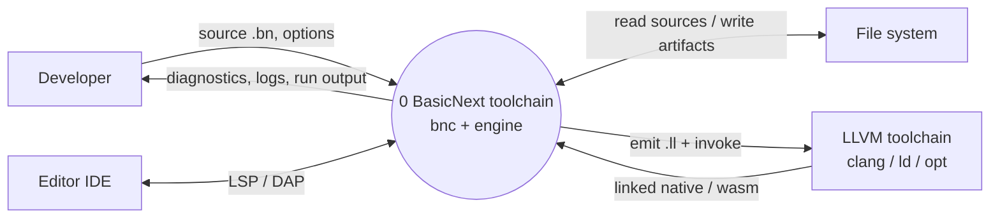

# DFD-0 — TO-BE (target architecture)

> **Canonical location:** `docs/architecture/dfd/dfd-0-to-be.md`
> Lives under **`docs/architecture/`**. As-is audit DFDs stay under `audit/` (local). Implementation: `ongoing/bucket-0.4.4.md` / `bucket-0.4.5.md`.

**Scope:** target toolchain architecture (design). This is **not** the as-is audit DFD.  
**Language posture:** BasicNext stays a **minimalist** language (few elements, standardization, object-orientation, expressiveness). This diagram describes the **tools around** that language, not new syntax.  
**Notation:** rectangle = external entity; circle = the whole system at level 0.

---

## Diagram

---
The point of level 0 is to name **who** exists and **what data** crosses the border.

At the highest level there is only **one system**: the BasicNext toolchain. Everything else is outside. The developer, the editor, the disk, and the industry LLVM tools talk to that system; they do not talk to each other through our product. 

Inside the system we will later open Frontend, Backend, controller, and log — but at DFD-0 those internals are still closed. 

The language itself stays small. Splitting the toolchain into controller and engine, or into frontend and backend, is about **how we build and run** the same small language — not about inventing a larger language.

---

## External entities (prose)

### E1 — Developer

The developer is the person (or a script they wrote) who authors `.bn` programs and asks the toolchain to check them, run them, or compile them.

In the target world they primarily talk to **`bnc`** (the controller). Today they talk to `bn` directly; the target puts a clear “front door” in front of the engine so options, pipeline choice, and process logging have one place to live. Typical requests are: “run this program” (default = interpret), “compile for my machine” (`-c`), “compile for another platform” (`-c --target …`), or “only analyze” (`--check`). They also pass mundane but important configuration: where programs live, how chatty the process log should be, where to write the output binary.

What comes back to them is not only “success or fail.” They get **diagnostics** (errors and warnings with locations), the **stdout/stderr of an interpreted run**, an **exit code**, and — when compiling — the **path of the artifact** plus a **companion process log** that recounts what the pipeline did. That log is for support and understanding, not a second secret language of errors: it should tell the same story as the diagnostics, at a verbosity they chose.

### E2 — Editor IDE

The editor (for example VS Code) is a second way a human reaches the same toolchain. It does not implement BasicNext. It speaks **LSP** (Language Server Protocol) for editing help — squiggles, hover, go-to-definition, completion — and **DAP** (Debug Adapter Protocol) when the user debugs.

In the target architecture the IDE must share the **same frontend → IR path** as the CLI. If the editor silently uses a weaker or different analysis path, the developer sees green in the IDE and red in `bnc --check`, which destroys trust. So E2 is drawn as an external entity, but the flows into process 0 are required to hit the same core, not a toy parser.

What the IDE sends is protocol traffic (document open/change, requests, debug launch). What it receives is diagnostics, symbol information, and debug state (paused location, variables). Shipping LSP/DAP as separate binaries later does not change this DFD-0 story; they remain doors into the same system 0.

### E3 — File system

The file system holds the durable stuff: project sources, optional config files, build outputs, and logs.

The toolchain **reads** `.bn` modules (and config when present) from disk. It **writes** native executables or `.wasm`, may write temporary LLVM `.ll` files during compile, and writes the companion process log next to (or under a configured directory for) the build. The programs-dir and plugins-dir ideas are really about **which places on this entity** we are allowed to search — plugins stay reserved until there is a safe loading story.

Nothing mystical here: if disk fails (permissions, full volume), the system must fail in a way the developer can see, without pretending the compile succeeded.

### E4 — LLVM toolchain (external)

This is **clang**, the linker, and optionally `opt` — tools the industry already maintains. They are **not** part of the BasicNext source tree as “our compiler frontend.” Our code emits LLVM IR (textual `.ll` or equivalent) and **invokes** those tools with an argument list; they return object code / a linked binary / a wasm module and an exit status.

Drawing E4 outside the circle is deliberate. It keeps a hard product boundary: BasicNext owns **language semantics on BN IR** and **lowering to LLVM IR**; the battle-tested code generator and linker stay external. We do **not** make LLVM’s `lli` the meaning of BasicNext “run” — that would replace our oracle with LLVM’s.

---

## System process 0 (prose)

### 0 — BasicNext toolchain (`bnc` + engine)

The circle is the whole product at level 0. Inside it (still opaque here) live:

- A **controller** (`bnc`, target): chooses the pipeline profile (check / interpret / compile), applies configuration, and records the process log.
- An **engine** (libraries behind today’s `bn`): runs the shared **frontend** until a single **IR** (Intermediate Representation) exists, then either **interprets that IR** or **compiles that IR** through `bn_llvm` toward E4.

The interpreter on **BN IR** is the **semantic oracle**: it defines what the language means. Compile must aim at the same IR, not at a second private meaning of the source text. That is how a minimalist language stays one language with two ways to execute.

Process 0 does **not**, at this level, expose HOST, dataframe, or HTTP as separate bubbles — those are internal to the engine’s backend when we open DFD-1. Process 0 also does not grow keywords or new language surface; architecture changes are about packaging and data flow.

---

## Main data flows

Border flows at level 0 (labels match the diagram). Component definitions and composition live in the **[data dictionary](data-dictionary.md)**.

1. **Developer → 0:** `source .bn`, `options`
2. **0 → Developer:** `diagnostics`, `logs`, `run output`
3. **0 ↔ File system:** read sources / write artifacts
4. **IDE ↔ 0:** `LSP` / `DAP`
5. **0 → LLVM toolchain:** emit `.ll` + invoke
6. **LLVM toolchain → 0:** linked native / wasm

---

## As-is vs this to-be (short)

Today the developer speaks to **`bn`** alone; process logging is informal; the IDE sometimes takes a thinner analysis path. The target keeps the same kind of externals, but puts a **controller** at the front door, insists on **one IR**, keeps LLVM **external**, and treats the IDE as another client of the **same** core.

As-is diagrams (audit trail, may be local/gitignored): `audit/workpapers/09-synthesis/dfd-*-as-is.md`.

---

## Next

**DFD-1 to-be** is written: [`dfd-1-to-be.md`](dfd-1-to-be.md).
