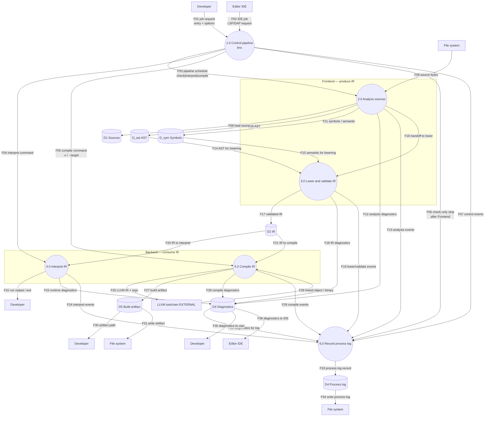

# DFD-1 — TO-BE

> Canonical: `docs/architecture/dfd/dfd-1-to-be.md`  
> Parent: [dfd-0-to-be.md](dfd-0-to-be.md)

**Notation:** rectangle = external entity (may repeat); circle = process; cylinder = data store.

**I/O rule:** every process has ≥1 inbound and ≥1 outbound data flow. Stage→Control **completion** returns are detailed in [DFD-2 Control](dfd-2/1.0 Control.md) (C21–C28); at DFD-1, Control still has inbound job requests and outbound schedules plus diagnostics/log paths that balance each process.

Starts at **1.0 Control**. All flows are named. External entities are drawn **next to each interaction**, even when the same entity appears more than once.

## Flow catalog

Short index of named flows. Full definitions (what each flow carries) live in the **[data dictionary](data-dictionary.md)**.

| Id | From → To | Name |
| --- | --- | --- |
| F01 | Developer → 1.0 | job request (entry + options) |
| F02 | Editor IDE → 1.0 | IDE job (LSP/DAP request) |
| F03 | 1.0 → 2.0 | pipeline schedule (check \| interpret \| compile) |
| F04 | 1.0 → 4.0 | interpret command |
| F05 | 1.0 → 5.0 | compile command (`-c` / `--target`) |
| F06 | 1.0 → 6.0 | check-only stop (after Frontend) |
| F07 | 1.0 → 6.0 | control events |
| F08 | File system → 2.0 | source bytes |
| F09 | 2.0 → D1 | load sources |
| F10 | 2.0 → D_ast | AST |
| F11 | 2.0 → D_sym | symbols / semantic |
| F12 | 2.0 → D3 | analysis diagnostics |
| F13 | 2.0 → 6.0 | analysis events |
| F14 | D_ast → 3.0 | AST for lowering |
| F15 | D_sym → 3.0 | semantic for lowering |
| F16 | 2.0 → 3.0 | handoff to lower |
| F17 | 3.0 → D2 | validated IR |
| F18 | 3.0 → D3 | IR diagnostics |
| F19 | 3.0 → 6.0 | lower/validate events |
| F20 | D2 → 4.0 | IR to interpret |
| F21 | D2 → 5.0 | IR to compile |
| F22 | 4.0 → Developer | run output / exit |
| F23 | 4.0 → D3 | runtime diagnostics |
| F24 | 4.0 → 6.0 | interpret events |
| F25 | 5.0 → LLVM EXTERNAL | LLVM IR + argv |
| F26 | LLVM EXTERNAL → 5.0 | linked object / binary |
| F27 | 5.0 → D5 | build artifact |
| F28 | 5.0 → D3 | compile diagnostics |
| F29 | 5.0 → 6.0 | compile events |
| F30 | D5 → Developer | artifact path |
| F31 | D5 → File system | write artifact |
| F32 | D3 → 6.0 | diagnostics for log |
| F33 | 6.0 → D4 | process log record |
| F34 | D4 → File system | write process log |
| F35 | D3 → Developer | diagnostics to user |
| F36 | D3 → Editor IDE | diagnostics to IDE |

**Note:** Completion/return flows from stages to Control (**C21–C28**) are intentional **DFD-2** detail (see [1.0 Control](dfd-2/1.0 Control.md)). DFD-1 does not duplicate them as F-flows; the catalog above is the stage/border graph only. Profile sequences that close the loop live in [../sequences.md](../sequences.md).

---

## Repeated entities (same logical actor)

| Label on diagram | Logical entity |
|------------------|----------------|
| Developer (Dev1–Dev4) | E1 Developer |
| Editor IDE (IDE1–IDE2) | E2 Editor IDE |
| File system (FS1–FS3) | E3 File system |
| LLVM toolchain EXTERNAL | E4 LLVM toolchain |

## See also

- [Data dictionary](data-dictionary.md) (flow and store definitions)
- Pipeline sequences (check/interpret/compile/LSP/DAP): [../sequences.md](../sequences.md)
- DFD-2 (one file per process): [dfd-2/README.md](dfd-2/README.md)
  - [1.0 Control](dfd-2/1.0 Control.md)
  - [2.0 Analyze Sources](dfd-2/2.0 Analyze Sources.md)
  - [3.0 Lower and Validate IR](dfd-2/3.0 Lower and Validate IR.md)
  - [4.0 Interpret IR](dfd-2/4.0 Interpret IR.md)
  - [5.0 Compile IR](dfd-2/5.0 Compile IR.md)
  - [6.0 Record process log](dfd-2/6.0 Record process log.md)
