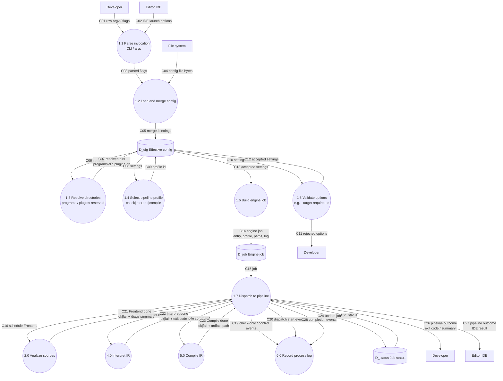

# DFD-2 — Process 1.0 Control pipeline (`bnc`) — TO-BE

> Canonical: `docs/architecture/dfd/dfd-2/1.0 Control.md`  
> Parent: [dfd-1-to-be.md](../dfd-1-to-be.md) (opens **1.0**)

**Notation:** rectangle = external entity **or neighbor process** (context); circle = **in-scope** subprocess; cylinder = data store.
**I/O rule:** every **in-scope** process (circle on this page) has ≥1 inbound and ≥1 outbound data flow. **Neighbors** (other DFD-1 processes) are drawn as **rectangles** here — context only; their balanced I/O is on their own DFD-2.

**Scope:** decompose **1.0 Control** only. Frontend 2.0 / Backend 4.0–5.0 / Log 6.0 appear as **neighbor** circles (not opened here).

**Note:** **1.7 Dispatch** both **starts** pipeline stages and **receives completion**; it then notifies the Developer (and Process log) with overall outcome.

## Flow catalog (1.0 internals)

| Id | From → To | Name |
|----|-----------|------|
| C01 | Developer → 1.1 | raw argv / flags |
| C02 | Editor IDE → 1.1 | IDE launch options |
| C03 | 1.1 → 1.2 | parsed flags |
| C04 | File system → 1.2 | config file bytes |
| C05 | 1.2 → D_cfg | merged settings |
| C06 | D_cfg → 1.3 | settings |
| C07 | 1.3 → D_cfg | resolved dirs (programs-dir, plugins-dir reserved) |
| C08 | D_cfg → 1.4 | settings |
| C09 | 1.4 → D_cfg | profile id |
| C10 | D_cfg → 1.5 | settings + profile |
| C11 | 1.5 → Developer | rejected options (error) |
| C12 | 1.5 → D_cfg | accepted settings |
| C13 | D_cfg → 1.6 | accepted settings |
| C14 | 1.6 → D_job | engine job (entry, profile, paths, log) |
| C15 | D_job → 1.7 | job |
| C16 | 1.7 → 2.0 | schedule Frontend |
| C17 | 1.7 → 4.0 | interpret command |
| C18 | 1.7 → 5.0 | compile command |
| C19 | 1.7 → 6.0 | check-only / control events |
| C20 | 1.7 → 6.0 | dispatch start events |
| **C21** | **2.0 → 1.7** | **Frontend done (ok\|fail + diags summary)** |
| **C22** | **4.0 → 1.7** | **Interpret done (ok\|fail + exit code)** |
| **C23** | **5.0 → 1.7** | **Compile done (ok\|fail + artifact path)** |
| **C24** | **1.7 → D_status** | **update job status** |
| **C25** | **D_status → 1.7** | **status** |
| **C26** | **1.7 → Developer** | **pipeline outcome (exit code / summary)** |
| **C27** | **1.7 → Editor IDE** | **pipeline outcome (IDE result)** |
| **C28** | **1.7 → 6.0** | **completion events** |

## Subprocesses of 1.0

| Id | Process |
|----|---------|
| 1.1 | Parse invocation (CLI / argv) |
| 1.2 | Load and merge config (CLI > file > defaults) |
| 1.3 | Resolve directories (programs-dir; plugins-dir reserved) |
| 1.4 | Select pipeline profile (check \| interpret \| compile) |
| 1.5 | Validate options (`--target` requires `-c`, unknown flags reject, …) |
| 1.6 | Build engine job |
| 1.7 | Dispatch to pipeline **and collect completion** (2.0 / 4.0 / 5.0 / 6.0) |

## Stores local to 1.0

| Id | Store |
|----|-------|
| D_cfg | Effective config after merge + validation |
| D_job | Engine job descriptor passed to the rest of the pipeline |
| D_status | Job status while stages run / final outcome |

## Data flow

### INPUT

| Flow | From | Meaning |
| --- | --- | --- |
| C01 | Developer | Raw argv / flags for the job. |
| C02 | Editor IDE | IDE launch / LSP-DAP options mapped into Control. |
| C04 | File system | Optional config file bytes. |
| C21–C23 | 2.0 / 4.0 / 5.0 | Stage completion (ok\|fail + summary). |

### OUTPUT

| Flow | To | Meaning |
| --- | --- | --- |
| C16–C20 | 2.0 / 4.0 / 5.0 / 6.0 | Schedule Frontend, interpret/compile commands, control events. |
| C11, C26 | Developer | Rejected options or final pipeline outcome. |
| C27 | Editor IDE | Pipeline outcome for IDE clients. |
| C28 | 6.0 | Completion events for the process log. |

---

## Process description

**1.0 Control** (`bnc`) is the pipeline front door: parse invocation, merge config, resolve directories, select profile (check \| interpret \| compile), validate options, build an engine job, **dispatch** stages, and **collect completion** so the Developer/IDE get one coherent outcome. Internals are subprocesses **1.1–1.7** in the diagram above.

---

## Associated modules (old architecture)

| Concern | Primary sources under `src/` |
| --- | --- |
| CLI / argv / help | `main.rs`, `cli_frontend.rs`, `cli_help.rs`, `cli_output.rs` |
| Toolchain / build orchestration | `cli_toolchain.rs` |
| Config | `config.rs` |
| Target Control | new `bnc` controller (not present as-is); today’s `bn` absorbs these duties |

## See also

- [dfd-2 README](README.md)
- [data-dictionary.md](../data-dictionary.md)
