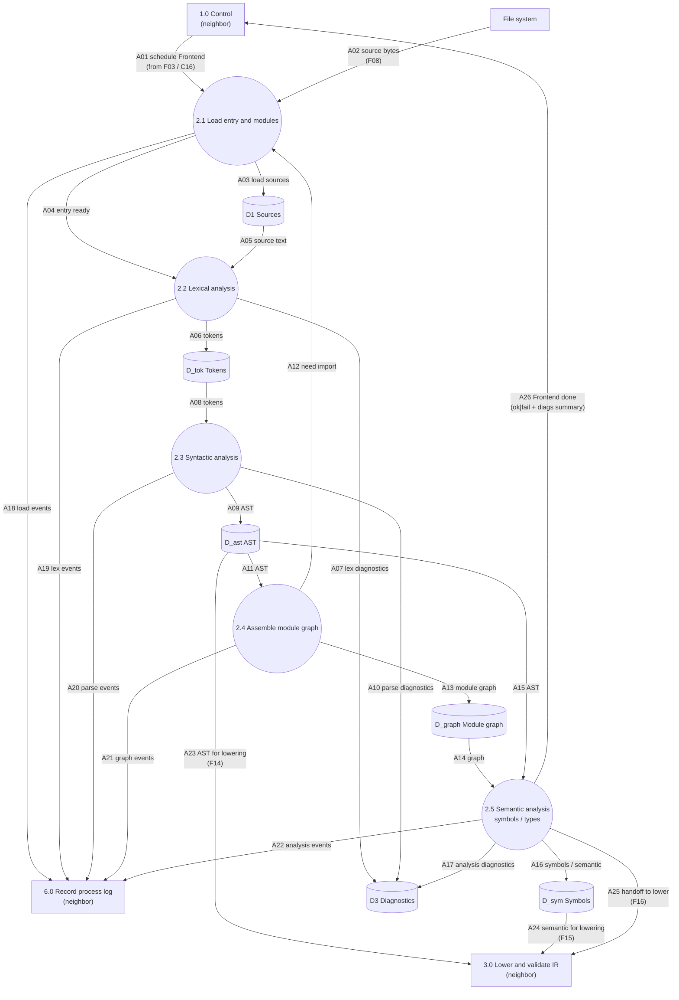

# DFD-2 — Process 2.0 Analyze Sources — TO-BE

> Canonical: `docs/architecture/dfd/dfd-2/2.0 Analyze Sources.md`  
> Parent: [dfd-1-to-be.md](../dfd-1-to-be.md) (opens **2.0**)  
> Data definitions: [data-dictionary.md](../data-dictionary.md) (`F08`–`F16`, stores `D1`, `D_ast`, `D_sym`, `D3`)

**Notation:** rectangle = external entity **or neighbor process** (context); circle = **in-scope** subprocess; cylinder = data store.
**I/O rule:** every **in-scope** process (circle on this page) has ≥1 inbound and ≥1 outbound data flow. **Neighbors** (other DFD-1 processes) are drawn as **rectangles** here — context only; their balanced I/O is on their own DFD-2.

**Scope:** decompose **2.0 Analyze Sources** only. Control **1.0**, Lower **3.0**, and Log **6.0** appear as **neighbors** (not opened here).

**Language posture:** this process produces syntax and semantic facts for **one** small language. It does not invent new surface syntax.

**Normative grammar:** lex/parse must match [`../../../language/0.4/0.4.ebnf`](../../../language/0.4/0.4.ebnf) (semantics in [`0.4.md`](../../../language/0.4/0.4.md)).

---

## Diagram

---

## Data flow

### INPUT

| Flow | From | Meaning |
| --- | --- | --- |
| A01 | 1.0 Control | Pipeline schedule for this job: entry path, resolved programs-dir, profile note that Frontend must run. |
| A02 / F08 | File system | Raw `.bn` module bytes for the entry and imports. |
| (loop) A12 | 2.4 → 2.1 | Request to load another imported module into the same job. |

### OUTPUT

| Flow | To | Meaning |
| --- | --- | --- |
| A03 / F09 | D1 | Loaded sources for the job. |
| A09 / F10 | D_ast | AST / program structure. |
| A16 / F11 | D_sym | Symbols and semantic model. |
| A07, A10, A17 / F12 | D3 | Lex, parse, and analysis diagnostics. |
| A18–A22 / F13 | 6.0 | Analysis-stage process-log events. |
| A23–A25 / F14–F16 | 3.0 | AST, semantic model, and handoff to Lower. |
| A26 | 1.0 | Frontend completion (ok\|fail + diagnostics summary) so Control can stop or continue. |

---

## Process description

**2.0 Analyze Sources** is the Frontend leg that turns **source text** into **AST + symbols** ready for IR lowering. Control starts it once per job. Inside:

1. **2.1 Load** resolves the entry (and later imports) against the file system and deposits texts in **D1**.
2. **2.2 Lexical analysis** turns each loaded module into tokens (**D_tok**), emitting lex diagnostics into **D3**.
3. **2.3 Syntactic analysis** builds the AST (**D_ast**), emitting parse diagnostics into **D3**.
4. **2.4 Assemble module graph** walks imports, may loop back to 2.1 for missing modules, and stores **D_graph**.
5. **2.5 Semantic analysis** builds the semantic/symbol model (**D_sym**) over the graph/AST (names, types, resolution).

When analysis succeeds enough to continue, 2.0 hands off to **3.0** (F14–F16). When the profile is check-only or on hard failure, Control still learns outcome via **A26**. IDE/`bnc --check` must reuse this same path — no toy parallel parser.

---

## Flow catalog (2.0 internals)

| Id | From → To | Name |
| --- | --- | --- |
| A01 | 1.0 → 2.1 | schedule Frontend |
| A02 | File system → 2.1 | source bytes |
| A03 | 2.1 → D1 | load sources |
| A04 | 2.1 → 2.2 | entry ready |
| A05 | D1 → 2.2 | source text |
| A06 | 2.2 → D_tok | tokens |
| A07 | 2.2 → D3 | lex diagnostics |
| A08 | D_tok → 2.3 | tokens |
| A09 | 2.3 → D_ast | AST |
| A10 | 2.3 → D3 | parse diagnostics |
| A11 | D_ast → 2.4 | AST |
| A12 | 2.4 → 2.1 | need import |
| A13 | 2.4 → D_graph | module graph |
| A14 | D_graph → 2.5 | graph |
| A15 | D_ast → 2.5 | AST |
| A16 | 2.5 → D_sym | symbols / semantic |
| A17 | 2.5 → D3 | analysis diagnostics |
| A18–A22 | 2.1–2.5 → 6.0 | stage events |
| A23 | D_ast → 3.0 | AST for lowering |
| A24 | D_sym → 3.0 | semantic for lowering |
| A25 | 2.5 → 3.0 | handoff to lower |
| A26 | 2.5 → 1.0 | Frontend done |

Full prose definitions for parent flows **F08–F16** / **F12–F13** are in the [data dictionary](../data-dictionary.md). `Axx` entries should be folded there as the dictionary grows.

---

## Subprocesses of 2.0

| Id | Process |
| --- | --- |
| 2.1 | Load entry and modules |
| 2.2 | Lexical analysis |
| 2.3 | Syntactic analysis |
| 2.4 | Assemble module graph |
| 2.5 | Semantic analysis (symbols / types) |

## Stores used by 2.0

| Id | Store | Role here |
| --- | --- | --- |
| D1 | Sources | Loaded module texts |
| D_tok | Tokens | Lex product (local to Analyze; may stay session-private) |
| D_ast | AST | Parse product shared with Lower |
| D_graph | Module graph | Import structure for analysis / lowering |
| D_sym | Symbols | Semantic model shared with Lower |
| D3 | Diagnostics | Lex/parse/analysis diagnostics |

---

## Associated modules (old architecture)

As-is `src/` owners that implement today’s equivalent Frontend work (traceability; target may re-crate without renaming language):

| Subprocess | Primary sources under `src/` |
| --- | --- |
| 2.1 Load | `module_graph.rs` |
| 2.2 Lexical analysis | `lexer.rs`, `source.rs`, `token.rs` |
| 2.3 Syntactic analysis | `parser.rs`, `parser/*.rs`, `keyword_registry.rs`, `ast.rs` |
| 2.4 Graph | `module_graph.rs` |
| 2.5 Semantic analysis | `semantic.rs`, `semantic/module_analysis.rs`, `semantic/analyzer*.rs`, `semantic/declarations.rs`, `semantic/types.rs`, `semantic/host_members*.rs`, … |
| Diagnostics | `diagnostic.rs` |

**As-is audit note:** the driver sometimes lex/parses the entry outside this ownership (shadow path). Target forbids that: one Frontend path for CLI and IDE.

---

## See also

- [1.0 Control](1.0 Control.md)
- [3.0 Lower and Validate IR](3.0 Lower and Validate IR.md)
- [data-dictionary.md](../data-dictionary.md)
