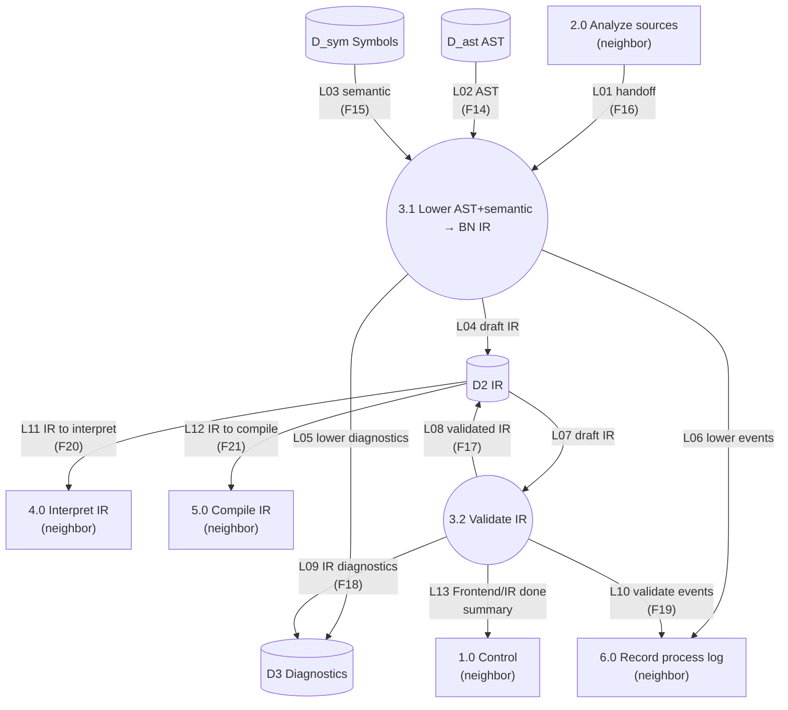

# DFD-2 — Process 3.0 Lower and Validate IR — TO-BE

> Canonical: `docs/architecture/dfd/dfd-2/3.0 Lower and Validate IR.md`  
> Parent: [dfd-1-to-be.md](../dfd-1-to-be.md) (opens **3.0**)  
> Data definitions: [data-dictionary.md](../data-dictionary.md) (`F14`–`F21`, store `D2`)

**Notation:** rectangle = external entity **or neighbor process** (context); circle = **in-scope** subprocess; cylinder = data store.
**I/O rule:** every **in-scope** process (circle on this page) has ≥1 inbound and ≥1 outbound data flow. **Neighbors** (other DFD-1 processes) are drawn as **rectangles** here — context only; their balanced I/O is on their own DFD-2.

**Scope:** decompose **3.0** only. Analyze **2.0**, Interpret **4.0**, Compile **5.0**, Log **6.0**, and Control **1.0** are neighbors.

---

## Diagram

---

## Data flow

### INPUT

| Flow | From | Meaning |
| --- | --- | --- |
| L01 / F16 | 2.0 | Handoff: Analyze finished enough to lower this job. |
| L02 / F14 | D_ast | AST / program structure for the job. |
| L03 / F15 | D_sym | Symbols and semantic facts required to lower correctly. |

### OUTPUT

| Flow | To | Meaning |
| --- | --- | --- |
| L08 / F17 | D2 | Validated **BN IR** — single Intermediate Representation for the job. |
| L05, L09 / F18 | D3 | Lowering and validation diagnostics. |
| L06, L10 / F19 | 6.0 | Lower/validate process-log events. |
| L11 / F20 | 4.0 | IR available to Interpret (when Control commanded interpret). |
| L12 / F21 | 5.0 | IR available to Compile (when Control commanded compile). |
| L13 | 1.0 | Summary so Control knows Frontend+IR finished ok or failed. |

---

## Process description

**3.0 Lower and Validate IR** turns Analyze products into the **one BN IR** that both backends consume. In the crate split: **3.1 Lower** is implemented inside **`bn_frontend`** (may stay an internal module); **3.2 Validate** belongs to **`bn_ir`**. Logical DFD process **3.0** stays one bubble; the dependency rule is: backends never import the analyzer. See [target-architecture.md](../../target-architecture.md) responsibility split.

1. **3.1 Lower** reads AST + semantic model and builds draft BN IR in **D2**.
2. **3.2 Validate** checks structural / **language** IR constraints, writes the validated form back to **D2**, and records IR diagnostics in **D3**. Target-support filtering (`validate_for` / support matrix) is a **separate** gate so an LLVM limitation is not reported as a language-invalid program — [support-matrix.md](../../support-matrix.md). Language `validate` must include **CFG definite assignment** of values (all executable paths), not merely block-order accumulation — [ir-contract.md](../../ir-contract.md).

Interpret and Compile must **not** lower from AST on their own. If validation fails hard, Control stops the Backend legs; check-only jobs may end after a successful D2 without running 4.0/5.0.

---

## Flow catalog (3.0 internals)

| Id | From → To | Name |
| --- | --- | --- |
| L01 | 2.0 → 3.1 | handoff to lower |
| L02 | D_ast → 3.1 | AST for lowering |
| L03 | D_sym → 3.1 | semantic for lowering |
| L04 | 3.1 → D2 | draft IR |
| L05 | 3.1 → D3 | lower diagnostics |
| L06 | 3.1 → 6.0 | lower events |
| L07 | D2 → 3.2 | draft IR |
| L08 | 3.2 → D2 | validated IR |
| L09 | 3.2 → D3 | IR diagnostics |
| L10 | 3.2 → 6.0 | validate events |
| L11 | D2 → 4.0 | IR to interpret |
| L12 | D2 → 5.0 | IR to compile |
| L13 | 3.2 → 1.0 | Frontend/IR done summary |

---

## Subprocesses of 3.0

| Id | Process |
| --- | --- |
| 3.1 | Lower AST + semantic → BN IR |
| 3.2 | Validate IR |

## Stores used by 3.0

| Id | Store | Role here |
| --- | --- | --- |
| D_ast | AST | Input from Analyze |
| D_sym | Symbols | Input from Analyze |
| D2 | IR | Draft then validated BN IR |
| D3 | Diagnostics | Lower/validate diagnostics |

---

## Associated modules (old architecture)

| Subprocess | Primary sources under `src/` |
| --- | --- |
| 3.1 Lower | `ir.rs` (`lower_graph`), `ir/lowering.rs`, `ir/lowering_callable.rs`, `ir/builder.rs`, `ir/builder/*.rs`, `ir/helpers.rs`, `ir/model.rs` |
| 3.2 Validate | `ir.rs` (`validate`), `ir/validate.rs` |
| Diagnostics | `diagnostic.rs` |

(As-is DFD numbered these 4.1 / 4.2 under an older Frontend numbering; target maps them under **3.0**.)

---

## See also

- [2.0 Analyze Sources](2.0 Analyze Sources.md)
- [4.0 Interpret IR](4.0 Interpret IR.md)
- [5.0 Compile IR](5.0 Compile IR.md)
- [data-dictionary.md](../data-dictionary.md)
