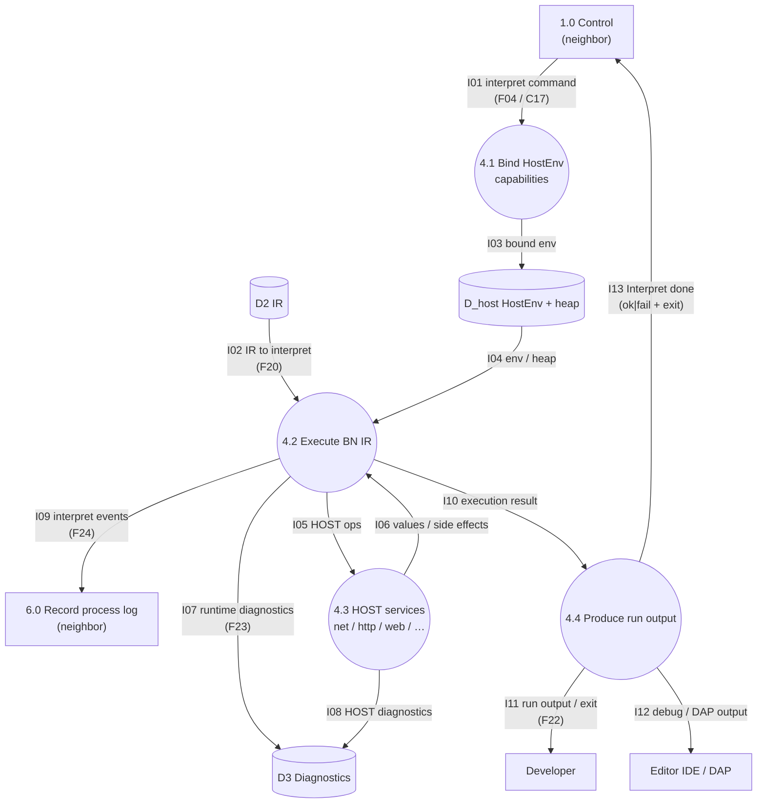

# DFD-2 — Process 4.0 Interpret IR — TO-BE

> Canonical: `docs/architecture/dfd/dfd-2/4.0 Interpret IR.md`  
> Parent: [dfd-1-to-be.md](../dfd-1-to-be.md) (opens **4.0**)  
> Data definitions: [data-dictionary.md](../data-dictionary.md) (`F04`, `F20`, `F22`–`F24`)

**Notation:** rectangle = external entity **or neighbor process** (context); circle = **in-scope** subprocess; cylinder = data store.
**I/O rule:** every **in-scope** process (circle on this page) has ≥1 inbound and ≥1 outbound data flow. **Neighbors** (other DFD-1 processes) are drawn as **rectangles** here — context only; their balanced I/O is on their own DFD-2.

**Scope:** decompose **4.0 Interpret IR** only. This path is the **semantic oracle** — LLVM `lli` is not the meaning of “run.”

---

## Diagram

---

## Data flow

### INPUT

| Flow | From | Meaning |
| --- | --- | --- |
| I01 / F04 | 1.0 | Authorization to interpret this job (after Frontend/IR ready). |
| I02 / F20 | D2 | Validated BN IR for the job. |

### OUTPUT

| Flow | To | Meaning |
| --- | --- | --- |
| I11 / F22 | Developer | Program stdout/stderr and program exit code. |
| I12 | Editor IDE | DAP debug events / evaluate results when debugging. |
| I07, I08 / F23 | D3 | Runtime and HOST diagnostics. |
| I09 / F24 | 6.0 | Interpret process-log events. |
| I13 | 1.0 | Interpret completion for Control (ok\|fail + exit code). |

---

## Process description

**4.0 Interpret IR** executes validated **BN IR** under a bound **HostEnv**.

1. **4.1 Bind HostEnv** installs capability flags and host providers for this run (filesystem, network policy, etc.).
2. **4.2 Execute** steps the IR on the runtime executor / heap.
3. **4.3 HOST services** implement platform calls (net, http, web, dispatch, dataframe, …) invoked from the executor. Target architecture must keep this dependency a **DAG** (traits / shared values downward — no runtime↔http cycles).
4. **4.4 Produce run output** surfaces stdout/stderr/exit to the Developer (and DAP when debugging), then reports completion to Control.

Check-only and compile-only profiles never enter 4.0.

---

## Flow catalog (4.0 internals)

| Id | From → To | Name |
| --- | --- | --- |
| I01 | 1.0 → 4.1 | interpret command |
| I02 | D2 → 4.2 | IR to interpret |
| I03 | 4.1 → D_host | bound env |
| I04 | D_host → 4.2 | env / heap |
| I05 | 4.2 → 4.3 | HOST ops |
| I06 | 4.3 → 4.2 | values / side effects |
| I07 | 4.2 → D3 | runtime diagnostics |
| I08 | 4.3 → D3 | HOST diagnostics |
| I09 | 4.2 → 6.0 | interpret events |
| I10 | 4.2 → 4.4 | execution result |
| I11 | 4.4 → Developer | run output / exit |
| I12 | 4.4 → Editor IDE | debug / DAP output |
| I13 | 4.4 → 1.0 | Interpret done |

---

## Subprocesses of 4.0

| Id | Process |
| --- | --- |
| 4.1 | Bind HostEnv (capabilities) |
| 4.2 | Execute BN IR |
| 4.3 | HOST services |
| 4.4 | Produce run output |

## Stores used by 4.0

| Id | Store | Role here |
| --- | --- | --- |
| D2 | IR | Input BN IR |
| D_host | HostEnv + heap | Runtime environment and values |
| D3 | Diagnostics | Runtime / HOST diagnostics |

---

## Associated modules (old architecture)

| Subprocess | Primary sources under `src/` |
| --- | --- |
| 4.1 Bind HostEnv | `runtime_impl.rs` (`HostEnv`); wired from `main.rs` / `cli_frontend.rs` / `dap.rs` |
| 4.2 Execute | `runtime_impl.rs`, `runtime.rs`, `runtime/executor.rs`, `runtime/executor/part*.rs`, `heap.rs` |
| 4.3 HOST | `net.rs`, `http.rs`, `web.rs`, `web_state.rs`, `tls.rs`, `dispatch.rs`, `dataframe.rs`, `temporal.rs`, `json.rs`, … |
| 4.4 Output | `runtime/render.rs`, `cli_output.rs`, `dap.rs` |

(As-is DFD numbered these 5.1–5.4.)

---

## See also

- [1.0 Control](1.0 Control.md)
- [3.0 Lower and Validate IR](3.0 Lower and Validate IR.md)
- [5.0 Compile IR](5.0 Compile IR.md)
- [data-dictionary.md](../data-dictionary.md)
