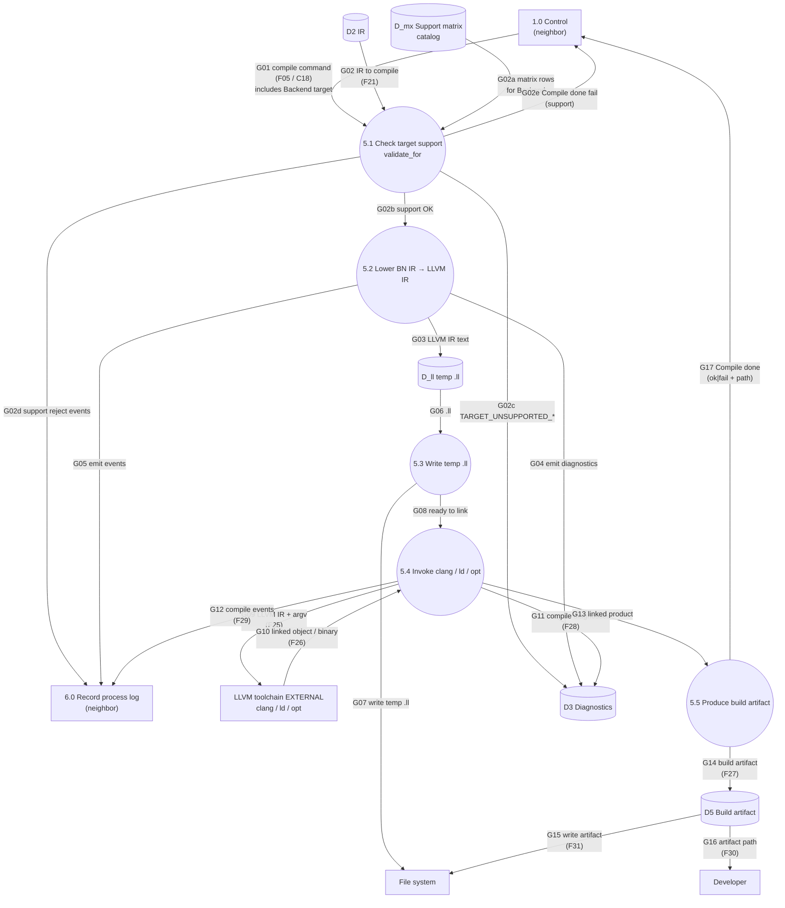

# DFD-2 — Process 5.0 Compile IR — TO-BE

> Canonical: `docs/architecture/dfd/dfd-2/5.0 Compile IR.md`  
> Parent: [dfd-1-to-be.md](../dfd-1-to-be.md) (opens **5.0**)  
> Data definitions: [data-dictionary.md](../data-dictionary.md) (`F05`, `F21`, `F25`–`F31`)
> **Updated 2026-09-06:** mandatory **`validate_for(target)`** before emit on every compile path (native + wasm). Production bar: no stub; support rejects use `TARGET_UNSUPPORTED_*`, not language-invalid IR.

**Notation:** rectangle = external entity **or neighbor process** (context); circle = **in-scope** subprocess; cylinder = data store.
**I/O rule:** every **in-scope** process (circle on this page) has ≥1 inbound and ≥1 outbound data flow. **Neighbors** (other DFD-1 processes) are drawn as **rectangles** here — context only; their balanced I/O is on their own DFD-2.

**Scope:** decompose **5.0 Compile IR** only. **LLVM toolchain** stays **external** (E4).

---

## Diagram

---

## Data flow

### INPUT

| Flow | From | Meaning |
| --- | --- | --- |
| G01 / F05 | 1.0 | Compile command (`-c`, optional `--target` → **Backend**, output path). |
| G02 / F21 | D2 | Same **language-validated** BN IR Interpret would run (`validate` already passed in 3.0). |
| G02a | D_mx / in-tree matrix | Support rows for this Backend (op×types×reject_diag×tests). |
| G10 / F26 | LLVM EXTERNAL | Linked native/wasm product + tool status. |

### OUTPUT

| Flow | To | Meaning |
| --- | --- | --- |
| G02c | D3 | **Support** diagnostics only (`TARGET_UNSUPPORTED_*`) — never presented as language/`INVALID_IR_*`. |
| G02e / G17 | 1.0 | Compile completion (fail on support reject **before** emit, or after link). |
| G09 / F25 | LLVM EXTERNAL | LLVM IR (`.ll`) + invoke argv — **only if** 5.1 passed. |
| G14 / F27 | D5 | Build artifact record. |
| G15 / F31 | File system | Durable artifact write. |
| G16 / F30 | Developer | Artifact path notification. |
| G04, G11 / F28 | D3 | Emit/link diagnostics (tool/IO). Prefer not to rediscover matrix gaps here. |
| G05, G12 / F29 | 6.0 | Compile process-log events. |

---

## Process description

**5.0 Compile IR** first checks **target support** for the selected Backend, then lowers **BN IR → LLVM IR**, invokes the **external** clang/ld/opt toolchain, and records the linked artifact.

### Mandatory gate: `validate_for` (production)

| Rule | Requirement |
| --- | --- |
| When | **Every** compile path: host native **and** `wasm32` (and any future Backend). |
| Where | Subprocess **5.1**, **before** 5.2 emit. |
| Input | Language-validated IR from **D2** + Backend from G01 + support catalog. |
| Fail | Emit `TARGET_UNSUPPORTED_OP` / `TYPE` / `HOST` / `TARGET` (stable codes) into **D3**; stop compile; **do not** call clang. |
| Pass | Proceed to 5.2. Emit must not be the first place users learn of a matrix gap. |
| Migration | Today’s mid-emit `BUILD_LOWERING_UNAVAILABLE` / `unsupported_instruction` sites must be **predicted by 5.1** with the matching support code, or removed as dead. |

Language `validate` (process **3.2**) remains a **separate** gate: IR well-formedness / CFG. Support failure ≠ invalid BN. See [ir-contract.md](../../ir-contract.md), [support-matrix.md](../../support-matrix.md), [to-close.md](../../to-close.md).

Interpret remains the **executable reference**; compile must match the **specification** on the support subset and must not invent a second meaning from AST.

---

## Flow catalog (5.0 internals)

| Id | Edge | Meaning |
| --- | --- | --- |
| G01 | 1.0 → 5.1 | compile command + Backend |
| G02 | D2 → 5.1 | IR to compile |
| G02a | matrix → 5.1 | support catalog slice |
| G02b | 5.1 → 5.2 | support OK |
| G02c | 5.1 → D3 | TARGET_UNSUPPORTED_* |
| G02d | 5.1 → 6.0 | support reject events |
| G02e | 5.1 → 1.0 | compile fail (support) |
| G03 | 5.2 → D_ll | LLVM IR text |
| G04 | 5.2 → D3 | emit diagnostics |
| G05 | 5.2 → 6.0 | emit events |
| G06–G08 | D_ll / 5.3 / 5.4 | temp `.ll` → link ready |
| G09 | 5.4 → EXT | LLVM IR + argv |
| G10 | EXT → 5.4 | linked product |
| G11 | 5.4 → D3 | compile/link diagnostics |
| G12 | 5.4 → 6.0 | compile events |
| G13–G16 | artifact path | D5 / FS / Developer |
| G17 | 5.5 → 1.0 | Compile done |

---

## Subprocesses of 5.0

| Id | Process |
| --- | --- |
| **5.1** | **Check target support (`validate_for(Backend)`)** |
| 5.2 | Lower BN IR → LLVM IR |
| 5.3 | Write temp `.ll` |
| 5.4 | Invoke clang / ld / opt |
| 5.5 | Produce build artifact |

## Stores used by 5.0

| Id | Store | Role here |
| --- | --- | --- |
| D2 | IR | Input BN IR (post–language `validate`) |
| D_mx | Support matrix | Machine-readable (or generating) catalog for Backends |
| D_ll | temp `.ll` | LLVM IR text for the session |
| D5 | Build artifact | Linked product metadata/path |
| D3 | Diagnostics | Support + emit/link diagnostics (distinct code families) |

---

## Associated modules (old architecture)

| Subprocess | Primary sources under `src/` |
| --- | --- |
| 5.1 `validate_for` | **to-be** `bn_ir` / matrix; today: must absorb rejects from `llvm/analysis.rs` / `unsupported_instruction` |
| 5.2 Emit LLVM | `llvm.rs` (`lower_module`), `llvm/emission*.rs`, `llvm/functions.rs`, `llvm/helpers.rs`, … |
| 5.3 Write `.ll` | `main.rs` / `cli_toolchain.rs` (build session temps) |
| 5.4 Invoke clang | `cli_toolchain.rs` → **external** clang/ld |
| 5.5 Artifact | build path → output file on FS |

---

## See also

- [3.0 Lower and Validate IR](3.0 Lower and Validate IR.md) — language `validate` only
- [4.0 Interpret IR](4.0 Interpret IR.md)
- [6.0 Record process log](6.0 Record process log.md)
- [support-matrix.md](../../support-matrix.md)
- [ir-contract.md](../../ir-contract.md)
- [data-dictionary.md](../data-dictionary.md)
