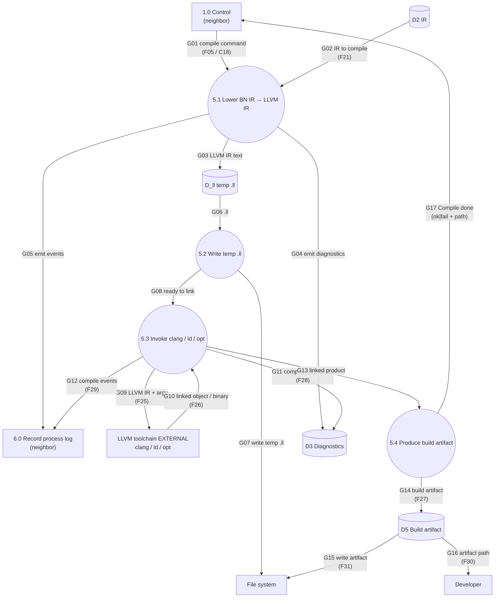

# DFD-2 — Process 5.0 Compile IR — TO-BE

> Canonical: `docs/architecture/dfd/dfd-2/5.0 Compile IR.md`  
> Parent: [dfd-1-to-be.md](../dfd-1-to-be.md) (opens **5.0**)  
> Data definitions: [data-dictionary.md](../data-dictionary.md) (`F05`, `F21`, `F25`–`F31`)

**Notation:** rectangle = external entity **or neighbor process** (context); circle = **in-scope** subprocess; cylinder = data store.
**I/O rule:** every **in-scope** process (circle on this page) has ≥1 inbound and ≥1 outbound data flow. **Neighbors** (other DFD-1 processes) are drawn as **rectangles** here — context only; their balanced I/O is on their own DFD-2.

**Scope:** decompose **5.0 Compile IR** only. **LLVM toolchain** stays **external** (E4).

---

## Diagram

---

## Data flow

### INPUT

| Flow | From | Meaning |
| --- | --- | --- |
| G01 / F05 | 1.0 | Compile command (`-c`, optional `--target`, output path). |
| G02 / F21 | D2 | Same validated BN IR Interpret would run. |
| G10 / F26 | LLVM EXTERNAL | Linked native/wasm product + tool status. |

### OUTPUT

| Flow | To | Meaning |
| --- | --- | --- |
| G09 / F25 | LLVM EXTERNAL | LLVM IR (`.ll`) + invoke argv. |
| G14 / F27 | D5 | Build artifact record. |
| G15 / F31 | File system | Durable artifact write. |
| G16 / F30 | Developer | Artifact path notification. |
| G04, G11 / F28 | D3 | Emit/link diagnostics. |
| G05, G12 / F29 | 6.0 | Compile process-log events. |
| G17 | 1.0 | Compile completion for Control. |

---

## Process description

**5.0 Compile IR** lowers **BN IR → LLVM IR**, invokes the **external** clang/ld/opt toolchain, and records the linked artifact.

1. **5.1 Lower BN IR → LLVM IR** (inside `bn_llvm` / today’s `llvm` module) — language semantics stay on BN IR; this step only targets LLVM.
2. **5.2 Write temp `.ll`** when the session keeps IR text on disk for clang.
3. **5.3 Invoke** external tools with argv (target triple, opts, `bn_rt` as needed); map tool failures into **D3**.
4. **5.4 Produce artifact** fills **D5** and reports completion to Control; durable write (**G15**) and Developer path notice (**G16**) are modeled as **D5** egress after that deposit (same pattern as other store-backed outputs).

Interpret remains the **executable reference**; compile must match the **specification** on the support subset and must not invent a second meaning from AST.

---

## Flow catalog (5.0 internals)

| Id | From → To | Name |
| --- | --- | --- |
| G01 | 1.0 → 5.1 | compile command |
| G02 | D2 → 5.1 | IR to compile |
| G03 | 5.1 → D_ll | LLVM IR text |
| G04 | 5.1 → D3 | emit diagnostics |
| G05 | 5.1 → 6.0 | emit events |
| G06 | D_ll → 5.2 | .ll |
| G07 | 5.2 → File system | write temp .ll |
| G08 | 5.2 → 5.3 | ready to link |
| G09 | 5.3 → LLVM EXTERNAL | LLVM IR + argv |
| G10 | LLVM EXTERNAL → 5.3 | linked object / binary |
| G11 | 5.3 → D3 | compile diagnostics |
| G12 | 5.3 → 6.0 | compile events |
| G13 | 5.3 → 5.4 | linked product |
| G14 | 5.4 → D5 | build artifact |
| G15 | D5 → File system | write artifact |
| G16 | D5 → Developer | artifact path |
| G17 | 5.4 → 1.0 | Compile done |

---

## Subprocesses of 5.0

| Id | Process |
| --- | --- |
| 5.1 | Lower BN IR → LLVM IR |
| 5.2 | Write temp `.ll` |
| 5.3 | Invoke clang / ld / opt |
| 5.4 | Produce build artifact |

## Stores used by 5.0

| Id | Store | Role here |
| --- | --- | --- |
| D2 | IR | Input BN IR |
| D_ll | temp `.ll` | LLVM IR text for the session |
| D5 | Build artifact | Linked product metadata/path |
| D3 | Diagnostics | Emit/link diagnostics |

---

## Associated modules (old architecture)

| Subprocess | Primary sources under `src/` |
| --- | --- |
| 5.1 Emit LLVM | `llvm.rs` (`lower_module`), `llvm/emission*.rs`, `llvm/functions.rs`, `llvm/helpers.rs`, … |
| 5.2 Write `.ll` | `main.rs` / `cli_toolchain.rs` (build session temps) — target: compile crate + Control orchestration |
| 5.3 Invoke clang | `main.rs` / `cli_toolchain.rs` → **external** clang/ld |
| 5.4 Artifact | same build path → output file on FS |

(As-is DFD numbered these 6.1–6.4 under “Backend compile.”)

---

## See also

- [3.0 Lower and Validate IR](3.0 Lower and Validate IR.md)
- [4.0 Interpret IR](4.0 Interpret IR.md)
- [6.0 Record process log](6.0 Record process log.md)
- [data-dictionary.md](../data-dictionary.md)
