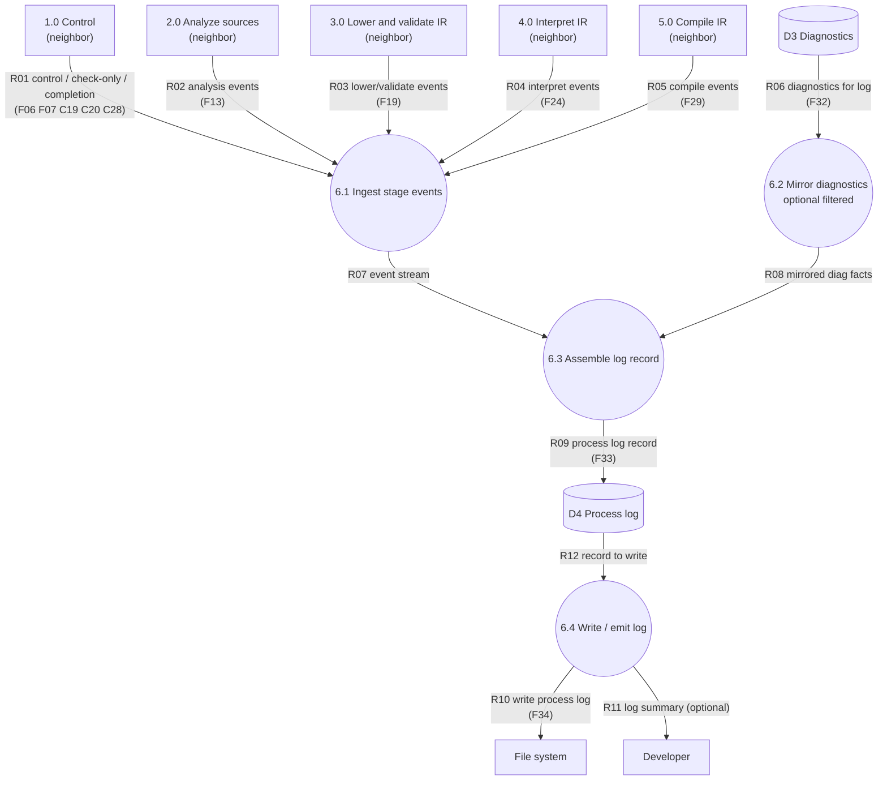

# DFD-2 — Process 6.0 Record process log — TO-BE

> Canonical: `docs/architecture/dfd/dfd-2/6.0 Record process log.md`  
> Parent: [dfd-1-to-be.md](../dfd-1-to-be.md) (opens **6.0**)  
> Data definitions: [data-dictionary.md](../data-dictionary.md) (`F06`–`F07`, `F13`, `F19`, `F24`, `F29`, `F32`–`F34`)

**Notation:** rectangle = external entity **or neighbor process** (context); circle = **in-scope** subprocess; cylinder = data store.
**I/O rule:** every **in-scope** process (circle on this page) has ≥1 inbound and ≥1 outbound data flow. **Neighbors** (other DFD-1 processes) are drawn as **rectangles** here — context only; their balanced I/O is on their own DFD-2.

**Scope:** decompose **6.0** only. The process log explains **what the toolchain did**; it is not a second private error language (diagnostics stay in **D3**).

---

## Diagram

---

## Data flow

### INPUT

| Flow | From | Meaning |
| --- | --- | --- |
| R01 | 1.0 | Control events, check-only stop, dispatch start, completion. |
| R02–R05 | 2.0–5.0 | Stage narrative events (started/finished, safe summaries, argv snapshots). |
| R06 / F32 | D3 | Optional mirror of diagnostic facts (codes, counts, selected messages) — must not contradict D3. |

### OUTPUT

| Flow | To | Meaning |
| --- | --- | --- |
| R09 / F33 | D4 | Assembled process-log record for the job. |
| R10 / F34 | File system | Durable companion log file via **6.4** (unless `--no-log`). |
| R11 | Developer | Optional short terminal summary from **6.4** (verbosity from `log-level`). |

---

## Process description

**6.0 Record process log** is the observability sink for the pipeline.

1. **6.1 Ingest** collects control and stage events in order.
2. **6.2 Mirror diagnostics** optionally copies selected diagnostic facts from **D3** so support can correlate failures with stages — still one truth: D3 owns diagnostics.
3. **6.3 Assemble** builds the job’s log record into **D4** (config snapshot safe to record, phases, tool argv, outcomes).
4. **6.4 Write / emit** reads the assembled record from **D4**, writes the companion file to the file system (**R10**), and may echo a short summary to the Developer (**R11**).

If logging is disabled, 6.0 may still accept events as no-ops or keep an in-memory trace for the session — product choice — but must never invent success when a stage failed.

---

## Flow catalog (6.0 internals)

| Id | From → To | Name |
| --- | --- | --- |
| R01 | 1.0 → 6.1 | control / check-only / completion events |
| R02 | 2.0 → 6.1 | analysis events |
| R03 | 3.0 → 6.1 | lower/validate events |
| R04 | 4.0 → 6.1 | interpret events |
| R05 | 5.0 → 6.1 | compile events |
| R06 | D3 → 6.2 | diagnostics for log |
| R07 | 6.1 → 6.3 | event stream |
| R08 | 6.2 → 6.3 | mirrored diag facts |
| R09 | 6.3 → D4 | process log record |
| R12 | D4 → 6.4 | record to write |
| R10 | 6.4 → File system | write process log |
| R11 | 6.4 → Developer | log summary (optional) |

---

## Subprocesses of 6.0

| Id | Process |
| --- | --- |
| 6.1 | Ingest stage events |
| 6.2 | Mirror diagnostics (optional, filtered) |
| 6.3 | Assemble log record |
| 6.4 | Write / emit log |

## Stores used by 6.0

| Id | Store | Role here |
| --- | --- | --- |
| D3 | Diagnostics | Source for optional mirror |
| D4 | Process log | Assembled narrative record |

---

## Associated modules (old architecture)

Today process logging is **informal** (scattered prints / ad hoc files). Traceability for a future implementation:

| Concern | Likely as-is touch points |
| --- | --- |
| CLI / build session | `main.rs`, `cli_toolchain.rs`, `cli_output.rs` |
| Config / verbosity | `config.rs` |
| Diagnostics mirror | `diagnostic.rs` |

Target: a dedicated log recorder behind Control, not a second error channel.

---

## See also

- [1.0 Control](1.0 Control.md)
- [dfd-1-to-be.md](../dfd-1-to-be.md)
- [data-dictionary.md](../data-dictionary.md)
