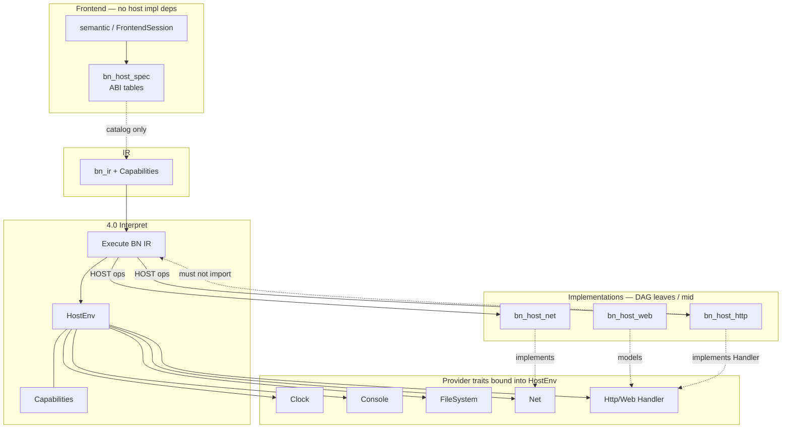

# HOST traits and HostEnv (architecture sketch)

> Canonical: `docs/architecture/host-traits.md`  
> **Status:** sketch **2026-09-05** — not a full API specification.  
> Expands the HOST layer of [target-architecture.md](target-architecture.md) and
> DFD-2 process **[4.0 Interpret IR](dfd/dfd-2/4.0 Interpret IR.md)**.

This note sketches how platform services sit behind traits so the language
core stays a **DAG**, sandbox policy stays honest, and semantic analysis never
imports concrete network or HTTP implementations. For product-level capability
direction (named `HOST` objects, bound functions, optional profiles), see the
proposal [`../../todo/proposals/host-capabilities.md`](../../todo/proposals/host-capabilities.md).
For BNWeb threat and resource policy that HostEnv must enforce at runtime, see
[`../../ongoing/0.4-threat-model.md`](../../ongoing/0.4-threat-model.md) and
[`../../ongoing/0.4-security-register.md`](../../ongoing/0.4-security-register.md).

---

## Why traits

Interpret (**4.0**) is the semantic oracle: it executes validated BN IR under a
bound **HostEnv**. HOST calls (filesystem, console, clock, net, http/web,
dispatch, and related services) are **side effects of that execution**, not a
second language. If semantic analysis or IR lowering depended on
`bn_host_http` or `bn_host_net` *implementations*, the package graph would
grow cycles and sandbox policy would fork between “check time” and “run time.”

The target split therefore keeps:

- **`bn_host_spec`** — ABI tables / member catalogs consumed by the Frontend
  (and docs): *what* HOST looks like to the language.
- **Provider traits** — interfaces the runtime binds into HostEnv: *how* a
  given process fulfills those members.
- **Concrete host crates** (`bn_host_net`, `bn_host_web`, `bn_host_http`, …) —
  implementations that sit **below** runtime in the DAG, never above Frontend.

**DAG rule (normative direction):** semantic analysis and IR validation **must
not** depend on http/net (or other host) *implementations*. They may depend on
`bn_host_spec` (and diagnostics). Runtime may depend on host crates; host
crates must not import `bn_runtime` (handler inversion — see target
architecture § Breaking the two cycles).

---

## HostEnv and Capabilities

At interpret start, subprocess **4.1 Bind HostEnv** installs:

| Concept | Role |
| --- | --- |
| **HostEnv** | Process-scoped environment: heap/handles, bound providers, policy mirrors, debug hooks. DFD store **D_host**. |
| **Capabilities** | Structured flags / bitset describing which HOST surfaces this run may use (aligned with IR `Capabilities` / wasm gates). Deny paths must be one shared story with driver policy. |
| **Providers** | Trait objects (or equivalent) for Clock, Console, FileSystem, Net, Http/Web handlers, and other profiles the job needs. |

Capabilities are not marketing labels. They are the sandbox contract that
check, interpret, compile-to-wasm, and IDE debug must read the same way
(crate roadmap **XM5**). A missing or denied capability yields a deterministic
diagnostic / typed unavailable result — never a silent downgrade.

---

## Provider traits (sketch, not API freeze)

Names below are architectural; exact Rust signatures live with the extract
milestones.

| Trait / façade (sketch) | Responsibility | Typical consumer |
| --- | --- | --- |
| **Clock** | Deterministic or wall time; injectable for tests | Runtime temporal ops; security tests |
| **Console** | Stdio / logging façade for program I/O (distinct from toolchain process log) | Interpret output; wasm console gates |
| **FileSystem** | Bounded read/write under policy | HOST.FileSystem; load paths already resolved by Control |
| **Net** | Sockets, resolve, CIDR helpers; optional ops fail closed when unavailable | `bn_host_net` |
| **Http / Web handlers** | Request/Response models + **Handler** trait registered *upward* from runtime/driver | `bn_host_web` / `bn_host_http` — no runtime import inside http |
| **Other profiles** | Dispatch, dataframe *ops*, Random, etc. | Co-located under runtime/host until deploy weight justifies a crate |

`bn_host_spec` answers “which members exist and what they mean in the language
catalog.” Implementations answer “how this OS or embedder fulfills them.”
Docs and semantic catalogs should generate from or share the spec tables so
Frontend never owns a divergent HOST truth.

---

## Component diagram

---

## Relation to DFD-2 4.0

| DFD subprocess | Trait sketch |
| --- | --- |
| **4.1 Bind HostEnv** | Install Capabilities + provider bindings for this job |
| **4.2 Execute BN IR** | Steps IR; requests HOST ops through HostEnv |
| **4.3 HOST services** | Net/http/web/… implementations behind traits |
| **4.4 Produce run output** | Console/run output and DAP views; completion to Control |

Flows **I01–I13** in [4.0 Interpret IR](dfd/dfd-2/4.0 Interpret IR.md)
carry the interpret command, IR, env/heap, diagnostics, and completion. This
sketch does not redefine those flows; it names the dependency inversion that
keeps **4.3** from becoming a cycle.

---

## Non-goals for this sketch

- Freezing Rust trait method lists or crate feature names.
- Replacing [`host-capabilities.md`](../../todo/proposals/host-capabilities.md)
  product questions (GPU/DOM bound functions, optional capability syntax).
- A second threat model — security controls stay indexed from
  [nfr-security.md](nfr-security.md).

## See also

- [target-architecture.md](target-architecture.md) — principles 4 and 6, cycle breaks, ownership table
- [ir-contract.md](ir-contract.md) — HostEnv vs backends on the IR boundary
- [support-matrix.md](support-matrix.md) — interpret × llvm coverage (stub)
- [glossary.md](glossary.md) — HostEnv, Capabilities, HOST, bn_host_spec
