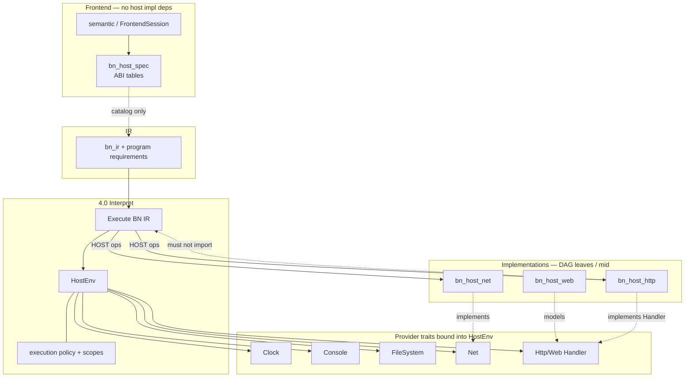

# HOST traits and HostEnv (architecture sketch)

> Canonical: `docs/architecture/host-traits.md`  
> **Status:** sketch **2026-09-05**; **three-dimension split locked** the same day — not a full API specification.  
> Expands the HOST layer of [target-architecture.md](target-architecture.md) and
> DFD-2 process **[4.0 Interpret IR](dfd/dfd-2/4.0 Interpret IR.md)**.

This note sketches how platform services sit behind traits so the language
core stays a **DAG**, sandbox policy stays honest, and semantic analysis never
imports concrete network or HTTP implementations. For product-level capability
direction (named `HOST` objects, bound functions, optional profiles), see the
proposal [`../../todo/proposals/host-capabilities.md`](../../todo/proposals/host-capabilities.md).
For BNWeb threat and resource policy that HostEnv must enforce at runtime, see
[`../../ongoing/0.4-threat-model.md`](../../ongoing/0.4-threat-model.md) and
[`../../ongoing/0.4-security-register.md`](../../ongoing/0.4-security-register.md).

---

## Why traits

Interpret (**4.0**) is the **executable reference**: it executes validated BN IR under a
bound **HostEnv**. HOST calls (filesystem, console, clock, net, http/web,
dispatch, and related services) are **side effects of that execution**, not a
second language. If semantic analysis or IR lowering depended on
`bn_host_http` or `bn_host_net` *implementations*, the package graph would
grow cycles and sandbox policy would fork between “check time” and “run time.”

The target split therefore keeps:

- **`bn_host_spec`** — ABI tables / member catalogs consumed by the Frontend
  (and docs): *what* HOST looks like to the language.
- **Provider traits** — interfaces the runtime binds into HostEnv: *how* a
  given process fulfills those members.
- **Concrete host crates** (`bn_host_net`, `bn_host_web`, `bn_host_http`, …) —
  implementations that sit **below** runtime in the DAG, never above Frontend.

**DAG rule (normative direction):** semantic analysis and IR validation **must
not** depend on http/net (or other host) *implementations*. They may depend on
`bn_host_spec` (and diagnostics). Runtime may depend on host crates; host
crates must not import `bn_runtime` (handler inversion — see target
architecture § Breaking the two cycles).

---

## Three dimensions (do not collapse into one “Capabilities” blob)

The word **Capabilities** in earlier drafts mixed three different questions.
They are related, but answers and failure modes must stay **separate**:

| Dimension | Question | Typical artifact | When checked |
| --- | --- | --- | --- |
| **Program requirements** | Which HOST services does **this program** need? | Declared/implied imports & HOST uses; IR/metadata “requires” set | Frontend / IR (static); recorded on the module |
| **Target support** | Which services does **this backend/provider** implement? | [support-matrix.md](support-matrix.md); provider availability | Check/compile (can I build/run here?) |
| **Execution policy** | Which operations are **authorized for this run**? | Job policy object (scopes, allowlists) — not a single boolean | Every HOST op at **runtime** (interpret **and** `bn_rt`) |

A program can be **valid**, **compilable** for a target that **supports** Net/FS, and still have an operation **denied** when executed under a tight policy. That outcome must be distinguishable from **“not implemented on this target.”**

### Distinct results (normative direction)

| Situation | Must look like |
| --- | --- |
| Program requires a service the **target does not implement** | Support / matrix failure — “unavailable on this backend” (check or compile diagnostic; not a policy deny) |
| Target implements it, but **this execution** forbids it | **Policy denial** — authorized-ops failure (runtime / `bn_rt`) |
| Policy allows it, but **scope** is violated (path outside allowlist, egress blocked) | Policy denial with **scope** detail — still not “unimplemented” |
| Language/`Error` path vs trap vs internal failure | Per [value-memory-abi.md](value-memory-abi.md) taxonomy |

Silent downgrade (pretending Net works when denied or missing) is forbidden.

### Program requirements

- Derived from what the program actually uses (`IMPORT HOST.…`, IR HOST ops, etc.).
- Lives with Frontend → IR metadata so tools can answer “what does this need?” without executing.
- Does **not** by itself authorize anything at runtime.

### Target support

- Answers “does interpret / llvm+`bn_rt` / wasm **provide** this service?”
- Owned by provider crates + support matrix — orthogonal to the operator’s allowlist for one job.

### Execution policy (authorization)

- Answers “may **this process** perform this operation **now**, under these scopes?”
- Must support **scope**, not only boolean availability:
  - Filesystem: roots/prefixes, read vs write, not just `fs=yes`.
  - Network: CIDR/port/scheme allowlists, not just `net=yes` (align with threat model).
- Applied on **every** sensitive HOST call in the executable reference (**HostEnv**) and in the **compiled** image (**`bn_rt` / linked policy**).

### Compiled binaries: how policy reaches the executable

A check or compile-time gate **alone** does not control operations the binary performs later. For `-c` / linked artifacts the architecture requires an explicit story:

1. **Policy materialization** — Control/driver supplies an execution policy (CLI/config/embedder API) when launching interpret **or** when producing/running a native/wasm artifact.
2. **Who enforces** — Sensitive ops in **`bn_rt`** (and any in-process HOST stubs) must **re-check** policy at the call boundary. Compiler-emitted “I proved FS was allowed at build time” is **not** sufficient for ops that happen after start.
3. **How it is carried** (implementation choices — pick one or combine; document in XM5):
   - Embed a **policy blob** / sealed config into the artifact or sidecar next to it;
   - Pass policy via **environment / launch argv** that `bn_rt` reads once at startup;
   - For embedders, inject policy through a **bn_rt init** API before any HOST call.
4. **Default-deny** for powerful surfaces when no policy is provided (product default may start permissive for local CLI — but the **mechanism** must exist and be testable).

Interpret **4.1 Bind HostEnv** and compile-linked **`bn_rt` init** are two faces of the same policy dimension.

---

## HostEnv, providers, and the three dimensions

At interpret start, subprocess **4.1 Bind HostEnv** installs:

| Concept | Role |
| --- | --- |
| **HostEnv** | Process-scoped environment: heap/handles, bound providers, **execution policy**, debug hooks. DFD store **D_host**. |
| **Program requirements** (metadata) | What this IR/module needs — not a grant of rights. |
| **Target support** (providers bound) | Which trait implementations exist for this backend. |
| **Execution policy** | Authorization + **scopes** for this run; enforced on each HOST op. |
| **Providers** | Trait objects for Clock, Console, FileSystem, Net, Http/Web, … |

Do not rename everything overnight in code; do not store “one bitset called Capabilities” that means all three. XM5 should **split or clearly namespace** IR/runtime fields along these dimensions.

---

## Provider traits (sketch, not API freeze)

Names below are architectural; exact Rust signatures live with the extract
milestones.

| Trait / façade (sketch) | Responsibility | Typical consumer |
| --- | --- | --- |
| **Clock** | Deterministic or wall time; injectable for tests | Runtime temporal ops; security tests |
| **Console** | Stdio / logging façade for program I/O (distinct from toolchain process log) | Interpret output; wasm console gates |
| **FileSystem** | Read/write under **scoped** policy (roots, mode) — not a boolean “fs on” | HOST.FileSystem; distinct from toolchain module-path |
| **Net** | Sockets/resolve; **support** vs **policy scope** (CIDR/port/scheme) are different failures | `bn_host_net` |
| **Http / Web handlers** | Request/Response models + **Handler** trait registered *upward* from runtime/driver | `bn_host_web` / `bn_host_http` — no runtime import inside http |
| **Other profiles** | Dispatch, dataframe *ops*, Random, etc. | Co-located under runtime/host until deploy weight justifies a crate |

`bn_host_spec` answers “which members exist and what they mean in the language
catalog.” Implementations answer “how this OS or embedder fulfills them.”
Docs and semantic catalogs should generate from or share the spec tables so
Frontend never owns a divergent HOST truth.

---

## Component diagram

---

## Relation to DFD-2 4.0

| DFD subprocess | Trait sketch |
| --- | --- |
| **4.1 Bind HostEnv** | Bind providers (**target support**) + install **execution policy** (scopes); record program requirements already on IR |
| **4.2 Execute BN IR** | Steps IR; requests HOST ops through HostEnv |
| **4.3 HOST services** | Net/http/web/… implementations behind traits |
| **4.4 Produce run output** | Console/run output and DAP views; completion to Control |

Flows **I01–I13** in [4.0 Interpret IR](dfd/dfd-2/4.0 Interpret IR.md)
carry the interpret command, IR, env/heap, diagnostics, and completion. This
sketch does not redefine those flows; it names the dependency inversion that
keeps **4.3** from becoming a cycle.

---

## Non-goals for this sketch

- Freezing Rust trait method lists or crate feature names.
- Replacing [`host-capabilities.md`](../../todo/proposals/host-capabilities.md)
  product questions (GPU/DOM bound functions, optional capability syntax).
- A second threat model — security controls stay indexed from
  [nfr-security.md](nfr-security.md).

## See also

- [target-architecture.md](target-architecture.md) — principles 4 and 6, cycle breaks, ownership table
- [ir-contract.md](ir-contract.md) — HostEnv vs backends on the IR boundary
- [support-matrix.md](support-matrix.md) — interpret × llvm coverage (stub)
- [glossary.md](glossary.md) — HostEnv, program requirements / target support / execution policy, HOST, bn_host_spec
- [value-memory-abi.md](value-memory-abi.md) — Error vs trap vs internal failure
- [conformance.md](conformance.md)
