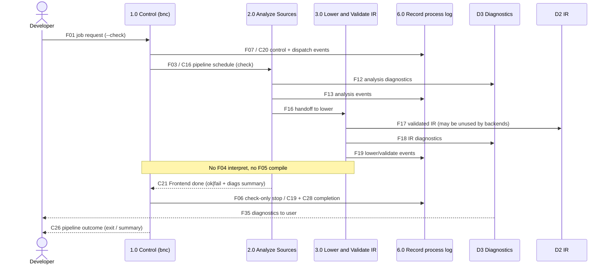
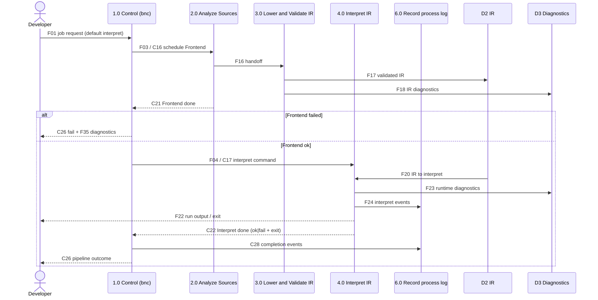
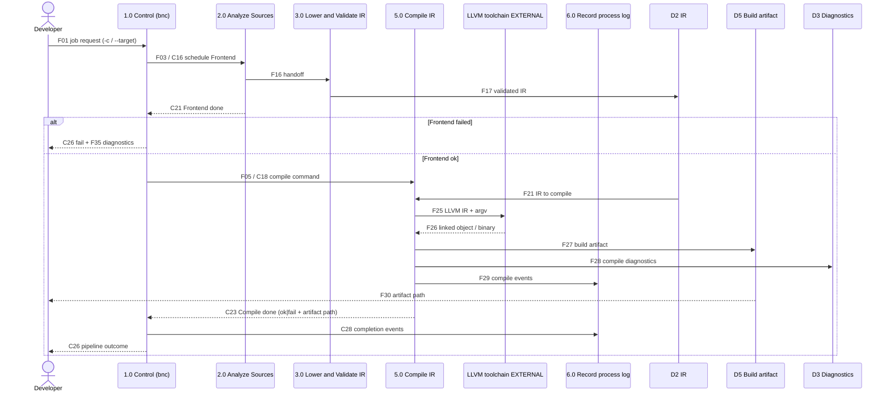
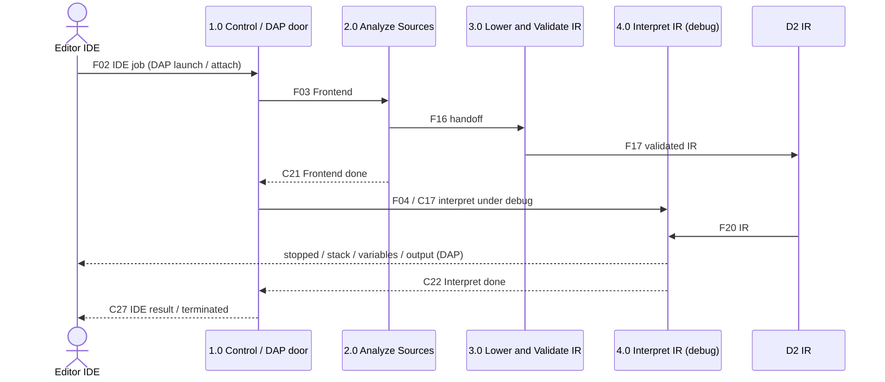

# Pipeline sequence diagrams (architecture companion)

> Canonical: `docs/architecture/sequences.md`  
> Status: companion to DFD-1 / DFD-2 — **2026-09-05**  
> Spelling: American English (**Analyze**, not Analyze).

These Mermaid sequences show how a job moves through the to-be pipeline for
the three Control profiles (**check**, **interpret**, **compile**) and for the
IDE doors (**LSP**, **DAP**). Process ids match the DFD decomposition
(**1.0–6.0**). Named stage flows at DFD-1 are **F** flows; Control-internal and
completion returns are **C** flows documented in
[DFD-2 1.0 Control](dfd/dfd-2/1.0 Control.md).

**Important layering note.** DFD-1 draws the stage graph (schedule Frontend,
interpret, compile, log, diagnostics to user/IDE) without duplicating every
completion arrow back to Control. Completion and return flows such as
**C21–C23** (stage done), **C26–C27** (outcome to Developer / IDE), and
**C28** (completion events to the process log) are intentional **DFD-2**
detail for process **1.0**. The sequences below may mention those returns so
readers see the closed loop; they are not missing F-flows on DFD-1.

See also: [dfd-1-to-be.md](dfd/dfd-1-to-be.md), [data-dictionary.md](dfd/data-dictionary.md),
[target-architecture.md](target-architecture.md).

---

## Profile: check (`bnc --check`)

Check-only runs the Frontend through **Lower and Validate IR**, then stops.
It does **not** enter **4.0 Interpret** or **5.0 Compile**. Diagnostics reach
the Developer (and may be mirrored into the process log). Control learns
Frontend completion via **C21** and records overall outcome via **C26** /
**C28**.



**Prose.** The Developer asks Control for an analyze-only job (**F01**).
Control schedules the Frontend (**F03** / **C16**), which Analyze Sources
(**2.0**) and Lower/Validate (**3.0**) fulfill: sources become AST/symbols,
then validated BN IR in **D2**, with diagnostics into **D3** and phase events
into **6.0**. Because the profile is check, Control never issues **F04** or
**F05**. Frontend completion (**C21**) lets **1.7 Dispatch** update status,
emit check-stop / completion log events, and return a single outcome to the
Developer together with diagnostics from **D3** (**F35**).

---

## Profile: interpret (default `bnc file.bn`)

Interpret runs the same Frontend path, then **4.0 Interpret IR** under
HostEnv. Program stdout/stderr and exit code return to the Developer; Control
receives **C22** when interpret completes.



**Prose.** After Frontend success, Control authorizes interpret (**F04** /
**C17**). Process **4.0** binds HostEnv, executes BN IR from **D2**, may emit
runtime/HOST diagnostics into **D3**, and streams run output to the Developer
(**F22**). Completion **C22** closes the Control loop so the controller exit
code and process log (**C28**, **F24**) agree with what the program did.
Interpret is the **executable reference** (spec is normative); this path is never replaced by LLVM
`lli`.

---

## Profile: compile (`bnc -c` / `-c --target`)

Compile reuses the Frontend, then **5.0 Compile IR** lowers BN IR to LLVM IR
and invokes the **external** LLVM toolchain. The artifact lands in **D5** /
the file system; Control receives **C23**.



**Prose.** Compile never invents a second meaning from AST alone: it consumes
the same validated BN IR (**F21**) that interpret would. Process **5.0** emits
LLVM IR and argv across the trust boundary to clang/ld/opt (**F25**), accepts
the linked product (**F26**), records the artifact (**F27** / **F30**), and
reports completion to Control (**C23**). Process-log events (**F29**, **C28**)
must capture tool argv without secrets.

---

## LSP: diagnostics from the shared Frontend

The editor does not get a toy parser. LSP traffic maps into Control / the same
Frontend session path; published diagnostics are projections of **D3**.

```mermaid
sequenceDiagram
  actor Ed as Editor IDE
  participant C as 1.0 Control / LSP frontend door
  participant A as 2.0 Analyze Sources
  participant L as 3.0 Lower and Validate IR
  participant D3 as D3 Diagnostics

  Ed->>C: F02 IDE job (LSP open/change / check-like)
  C->>A: F03 schedule Frontend (same path as --check)
  A->>L: F16 handoff (required for check-equivalent diagnostics)
  A->>D3: F12 analysis diagnostics
  L->>D3: F18 IR / validate diagnostics
  Note over A,L: Snapshots are (SourceId, Revision, text); publish only for matching revision — see frontend-session.md
  D3-->>Ed: F36 publishDiagnostics (from D3, revision-scoped)
  C-->>Ed: C27 pipeline / session outcome (as applicable)
```

**Prose.** **F02** is the IDE front door into the same circle as CLI jobs.
**Baseline** Problems / `publishDiagnostics` must run the **same** Analyze →
Lower → language **`validate`** stages as `bnc --check` on the editor’s
**current snapshots** (including unsaved buffers), so squiggles match CLI check
for the same text. “Lower as needed” is **not** the default diagnostics path;
it only applies to optional IR-consuming IDE features beyond check-equivalent
diagnostics — [frontend-session.md](frontend-session.md). **F36** publishes
diagnostic *facts* from **D3** tagged with **SourceId + Revision**; never apply
an older revision’s results to a newer buffer. Shipping `bn-lsp` as its own
binary later does not add a new semantic path; it remains a door into process
**0** / **1.0**.

---

## DAP: debug launch through Interpret

Debug launch drives **4.0 Interpret** under debug control. Stopped events and
variables come from the reference interpreter on IR, not from a second runtime.



**Prose.** DAP is interpret-shaped: after Frontend readiness, Control issues
an interpret command with debug hooks (**4.1–4.4** in DFD-2 of Interpret).
Stopped events, evaluate results, and variable snapshots are views of the
same HostEnv/heap execution that a normal run would use. That keeps
conformance tests and interactive debugging on one semantic story.

---

## Flow id quick reference

| Kind | Where defined | Role in sequences |
| --- | --- | --- |
| **F01–F36** | [DFD-1](dfd/dfd-1-to-be.md) + [data dictionary](dfd/data-dictionary.md) | Stage and border flows |
| **C16–C20** | [DFD-2 1.0](dfd/dfd-2/1.0 Control.md) | Dispatch start (Frontend / interpret / compile / log) |
| **C21–C23** | DFD-2 1.0 | Stage completion back to Control |
| **C26–C28** | DFD-2 1.0 | Outcome to Developer/IDE + completion log events |

DFD-1 intentionally omits drawing **C21–C28** as F-flows; see the note on
[dfd-1-to-be.md](dfd/dfd-1-to-be.md).
