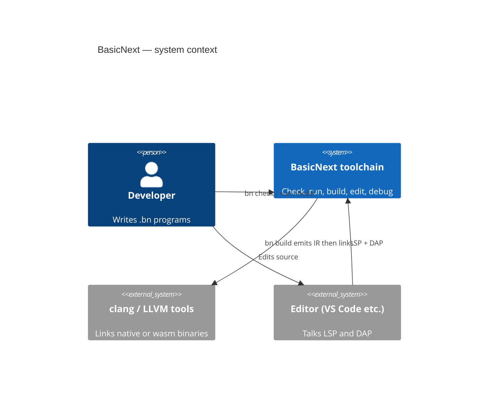
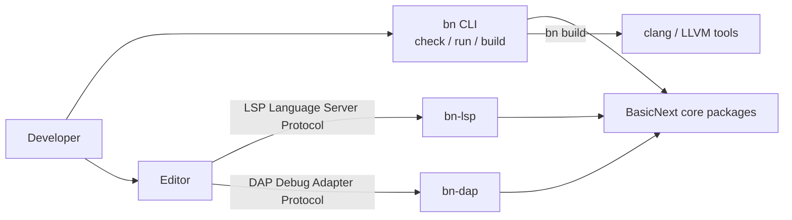
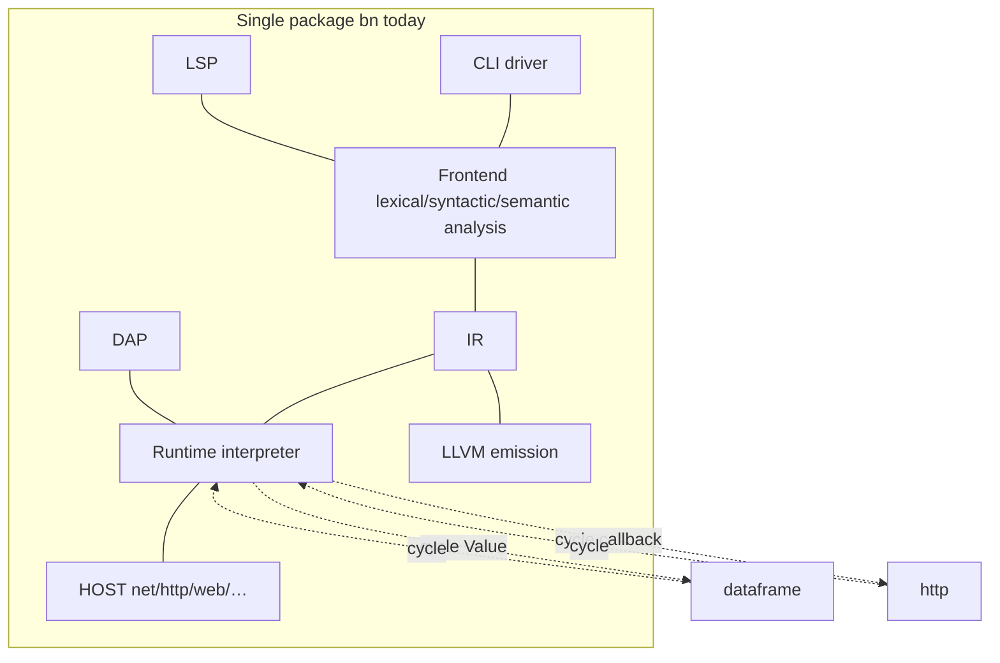
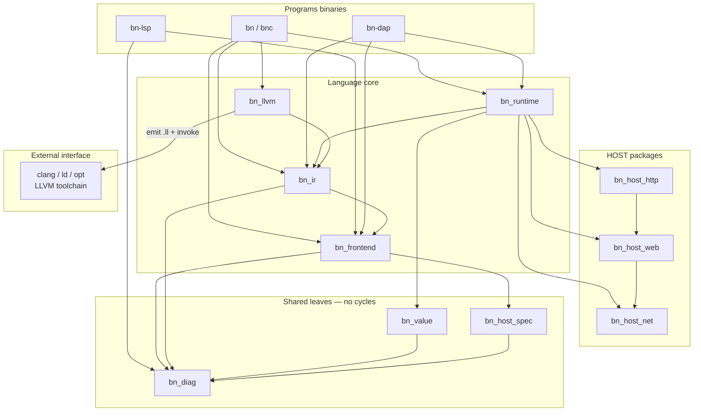
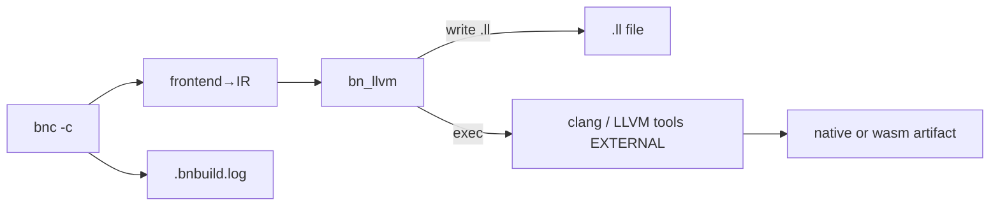
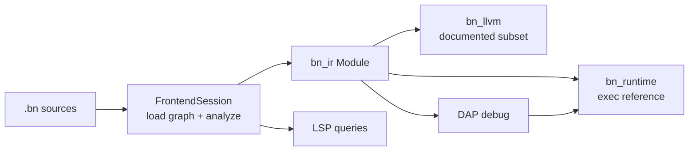
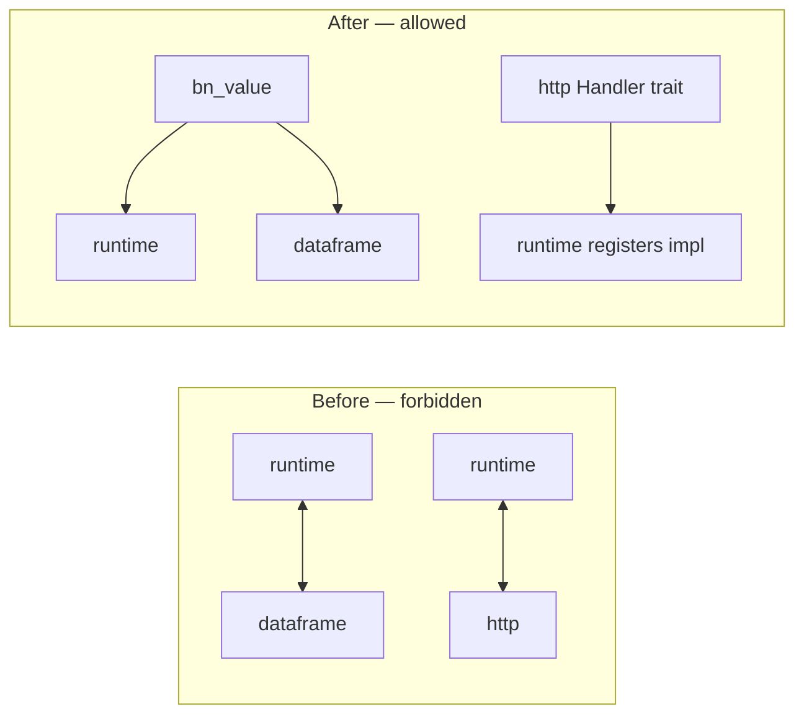
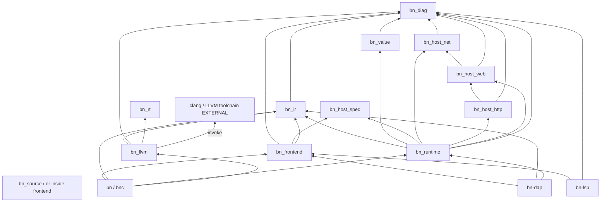
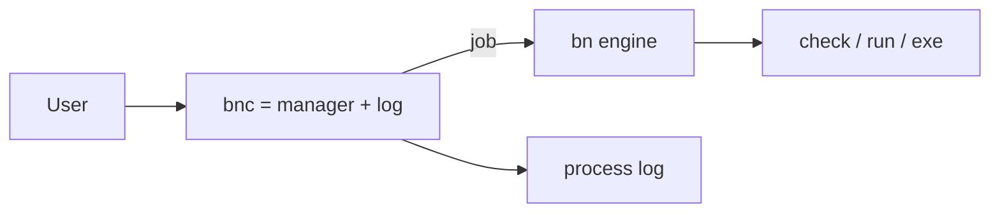
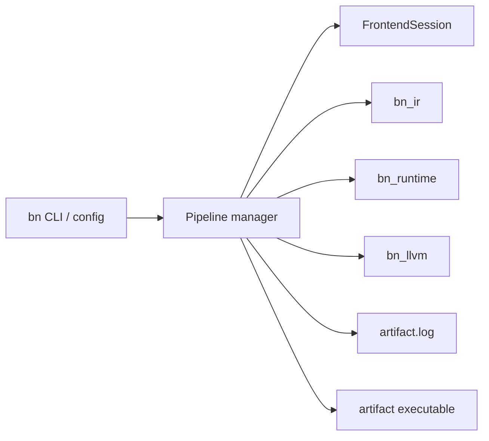

# Target Architecture — BasicNext

**Product type:** language toolchain — shared frontend → **IR** (Intermediate Representation), **interpreter as executable reference** (subordinate to the language specification), optional **LLVM** (Low Level Virtual Machine) backend, **HOST** platform services behind traits, **IDE** (Integrated Development Environment) hosts via **LSP** (Language Server Protocol) and **DAP** (Debug Adapter Protocol).  
**Hard rule:** **acyclic** package graph — a **DAG** (Directed Acyclic Graph): no A↔B circular dependencies; extract shared types downward; invert callbacks via traits.  
**Split rule:** separate program/**crate** (Rust package) only when ≥2 of: different lifecycle, deploy weight, clear API, reduces coupling (`plan.md`).

---

## Principles

1. **Specification above implementations** — The **language specification** (`docs/language/…`, especially `0.4.md`) defines language+HOST **behaviour**. `bn_runtime` (interpret) is the **executable reference implementation** of that behaviour — not a second law. A bug in the interpreter must be fixed to match the spec; it must **not** become mandatory behaviour for the compiler. LLVM/`bn_llvm` must be **equivalent** on the **documented supported subset** ([support-matrix.md](support-matrix.md)). Validation uses **two** comparisons: (a) each backend against **expected results derived from the specification**, and (b) backends **against each other** on the shared subset. Because Frontend and lowering are shared, both backends can agree on the **same static error** — that agreement is necessary but **not sufficient** if both inherit a Frontend bug; expected results must still be grounded in the spec.
2. **Shared frontend → IR** — one `FrontendSession` / graph+analyze+**lower** path for CLI, LSP, DAP. No shadow ASTs; no single-file LSP fork. Session must handle **snapshots** (incl. unsaved), **revisions**, invalidation, cancel, and revision-scoped diagnostics; spans carry **SourceId** through lowering ([frontend-session.md](frontend-session.md)). Backends start from **validated `bn_ir`**, never from AST/semantic crates.
3. **Thin CLI** — `bn` binary owns flags, toolchain discovery, and orchestration only. It does not own parse/semantic/HOST catalogs.
4. **HOST behind traits** — network/http/web/dispatch/fs/console are provider interfaces. Semantic and docs consume **`bn_host_spec`** (ABI tables), never http/net implementations.
5. **Diagnostics sink** — all engines emit into a shared `bn_diag` taxonomy (codes + spans). Render path targets **Fluent** `.ftl` catalogs (see [`../../todo/proposals/expressive-diagnostics.md`](../../todo/proposals/expressive-diagnostics.md); bucket 0.4.5). Build/llvm must not bypass with bare `String`.
6. **DAG crates** — dependency arrows point downward only. Forbidden: runtime↔dataframe on Value, runtime↔http on callbacks, semantic→HOST impl, lsp inventing a parallel frontend.
7. **Incremental migration** — extract leaves and invert cycles first; cut crates without maintaining a second implementation (“no DNA growth”).

---

## Language posture (product constraint)

BasicNext’s **language** target is **minimalist**: few elements, strong
standardization, object-orientation, and expressiveness without a large
surface. Toolchain architecture must **serve** that posture:

- Prefer completing and clarifying existing constructs over new keywords,
  HOST capabilities, or IR instruction kinds.
- Crate/binary splits organize **implementation**, they do not justify
  growing the language.
- The IR + interpret|compile split exists so **one** small language has
  **two** execution modes—not so two dialects can diverge.

(Stakeholder lock 2026-09-04: focus architecture work on this minimalist
language frame.)

## FE/BE split milestones

Canonical soft→hard action list: [`../../audit/workpapers/09-synthesis/fe-be-split-milestones.md`](../../audit/workpapers/09-synthesis/fe-be-split-milestones.md) (**SM0–SM7**).

Crosswalk with this document’s crate-extraction roadmap (**XM0–XM11**) and release buckets: [`milestones-map.md`](milestones-map.md).

## Modeling diagrams

- **DFD-0 to-be:** [`dfd/dfd-0-to-be.md`](dfd/dfd-0-to-be.md)
- **DFD-1 to-be:** [`dfd/dfd-1-to-be.md`](dfd/dfd-1-to-be.md)
- **DFD-2 (per process):** [`dfd/dfd-2/README.md`](dfd/dfd-2/README.md)
- **Data dictionary:** [`dfd/data-dictionary.md`](dfd/data-dictionary.md)
- **As-is audit DFDs** (local/gitignored): `audit/workpapers/09-synthesis/dfd-*-as-is.md`

**Language syntax (not toolchain DFD):** normative EBNF [`../language/0.4/0.4.ebnf`](../language/0.4/0.4.ebnf) + semantics [`../language/0.4/0.4.md`](../language/0.4/0.4.md).


> Audience: leadership and engineers. Acronyms expanded on first use in this section when the diagram caption needs them.

### 1. Context — what the product is (C4 context)



If C4 rendering is unavailable, use this equivalent:



### 2. As-is — one monolith (problem)



### 3. To-be — layered DAG (target)

`bn_llvm` is an **internal package**. The **LLVM toolchain** (clang, linker, optional `opt`) is an **external interface**: `bn_llvm` emits `.ll` / bitcode and **invokes** those tools; it does not embed the full LLVM libraries as the product boundary.



Compile pipeline (controller view):




### 4. Pipeline — one session for all tools



### 5. Breaking the two cycles




## Proposed crate / binary split

### Dependency DAG (to-be)



> **IR independence (locked 2026-09-05):** `bn_ir` must **not** depend on `bn_frontend`. Backends (`bn_runtime`, `bn_llvm`) consume **validated IR only** and must not pull the semantic analyzer transitively. **Lowering** (AST+semantic → BN IR) lives in **`bn_frontend`** (may remain an internal module; no new crate / no HIR required for this rule). Today’s `src/ir/model.rs` importing `semantic::{SymbolId, Type}` and `module_graph::ModuleId` is **as-is debt** to erase when cutting crates (IR-owned ids/types instead).
>
> **`bn_source` leaf (locked 2026-09-05):** `SourceId` / `Revision` / `Span` are **not** frontend-private. `bn_source` sits **below** `bn_frontend`, `bn_diag`, and `bn_ir` so IR/diagnostics never import the frontend for locations — [frontend-session.md](frontend-session.md).

### Ownership table

| Crate / binary | Owns | Depends on | Split justification |
|----------------|------|------------|---------------------|
| **`bn_source`** | `SourceId`, `Revision`, `Span`, source text helpers | (true leaf) | **Locked shared leaf** — diag/ir/frontend depend here; never only-inside-frontend |
| **`bn_diag`** | `Diagnostic`, code catalog, render | **`bn_source`**, (fluent later) | Clear API + reduces coupling (score 2) |
| **`bn_value`** | Interpreter `Value` / handles / dataframe column payloads | `bn_diag` | Clear API + **breaks cycle** (score 2) — mandatory extract; **does not** alone define interpret↔compile equivalence ([value-memory-abi.md](value-memory-abi.md)) |
| **`bn_host_spec`** | HOST member/capability schema consumed by semantic & docs | `bn_diag` | Lifecycle + clear API + reduces FE↔HOST churn (3) |
| **`bn_frontend`** | lexer, parser, AST, tokens, module_graph, semantic, **lowering to BN IR**, `FrontendSession` | **`bn_source`**, diag, host_spec, **`bn_ir`** (writes IR) | Lifecycle (IDE+CLI) + API + coupling (3) |
| **`bn_ir`** | **own** IR types/ids, instructions, module model, **validation** (incl. CFG definite assignment), support-matrix types | **`bn_source`**, diag (**not** frontend/semantic) | Semver lifecycle + API + coupling (3); **consumable without the analyzer** |
| **`bn_host_net`** | sockets/TLS primitives, CIDR, low-level net | diag | Deploy + API + lifecycle + coupling (4) |
| **`bn_host_web`** | Request/Response/EgressPolicy models, web limits | net, diag | Deploy + API + lifecycle (4) |
| **`bn_host_http`** | client/server transport; **`Handler` trait** (no runtime import) | web, diag | Deploy + API + **breaks callback cycle** (4) |
| **`bn_runtime`** | Executor scheduler, HostEnv, provider facades, heap, dispatch, dataframe *ops*, debug hooks | ir, value, host_*, spec, diag | Reference runtime lifecycle + deploy + API (4) |
| **`bn_llvm`** | textual LLVM emission, analysis, bn_rt call lowering | ir, diag, bn_rt | Deploy (clang/wasm) + lifecycle + API (4); **optional** feature |
| **`bn_rt`** | native helpers / **ABI surface** for linked binaries; may be shared with interpret for HOST-adjacent helpers | (existing) | Keep crate; **expand documented ABI** — see [value-memory-abi.md](value-memory-abi.md) |
| **`bn`** (binary) | CLI parse, toolchain, check/run/build orchestration | frontend, ir, runtime, llvm (features) | Thin driver |
| **`bn-lsp`** (binary / `bn_lsp` lib) | LSP protocol; queries session | frontend, diag — **not** runtime | Lifecycle + deploy + API (4) |
| **`bn-dap`** (binary / `bn_dap` lib) | DAP protocol; `execute_with_host_debug_control` | frontend, ir, runtime | Lifecycle + deploy + API (4) |

### Responsibility split (Frontend / IR / backends)

| Component | Responsibility |
| --- | --- |
| **Frontend** (`bn_frontend`) | AST, name resolution, semantic analysis, and **lowering** to BN IR |
| **IR** (`bn_ir`) | Own types, instructions, identities, and **validation** of IR — no import of the semantic analyzer |
| **Interpreter** (`bn_runtime`) | Execute **validated** IR |
| **LLVM backend** (`bn_llvm`) | Convert **validated** IR to the target (then external clang/ld) |

Lowering may stay an **internal module** of the frontend. This rule does **not** require a new crate or HIR. The point is: **understand and consume IR without importing the semantic analyzer**.

### Dropped / deferred (fail split rule or premature)

| Candidate | Why dropped |
|-----------|-------------|
| `bn_ide_core` | Only soft coupling win; prefer methods on `FrontendSession` |
| `bn_toolchain` crate | Driver module enough (1 criterion) |
| `bn_hir` | P3 only (F-IR-005); revisit for alt frontends |
| Standalone `bn_json` / `bn_heap` / `bn_dispatch` | Co-locate under runtime/host until deploy weight justifies |
| Merging lsp+dap forever in `bn` | UX subcommands OK interim; **crate/binary split still recommended** for deploy weight |

### Feature gates (interim or permanent)

`default = ["runtime", "llvm"]` with optional `lsp`, `dap`, `host-web` reduces install weight before or beside crate splits. Features do **not** replace the DAG requirement.

---

## How to break known cycles

### 1. `dataframe` ↔ `runtime` (F-XV-CYCLE-001 / F-HOST-003)

**Today:** `dataframe.rs` uses `crate::runtime::Value`; `runtime_impl` stores `DataFrameResource`.

**Target:**

```
bn_value::Value  ←── bn_dataframe (or module in runtime crate)
                 ←── bn_runtime
```

- Move `Value` (and any handle ids needed for columns) into `bn_value`.
- Dataframe APIs take/return `bn_value` types.
- Runtime imports dataframe resources **one-way**.

### 2. `runtime` ↔ `http` (F-XV-CYCLE-002 / F-HOST-002)

**Today:** `executor/part4` builds `http::Handler` whose body calls `runtime::execute_web_callback` with cloned `Module`+`HostEnv`.

**Target (dependency inversion):**

```
bn_host_http defines:
  trait HttpHandler: Send + Sync { fn handle(&self, req: Request) -> Response; }
  // or Box<dyn Fn(Request) -> Response>

bn_runtime (or driver) implements / registers handler
bn_host_http never imports bn_runtime
```

- Wiring lives in runtime façade or `bn` driver when starting BNWeb serve.
- http unit tests supply a stub handler — no interpreter required.

### Near-cycles (not Rust mutual `use`, still fix)

- **Semantic HOST catalogs** — move to `bn_host_spec`; semantic stops owning the source of truth (F-FE-002).
- **LSP vs CLI** — same session API (F-TOOL-001); not an import cycle but a behavioral fork.

---

## Contracts between components

| Boundary | Contract | Stability |
|----------|----------|-----------|
| **CLI ↔ frontend** | `FrontendSession` snapshot APIs; `open(path)` is CLI convenience over filesystem snapshots | Stable for tools — [frontend-session.md](frontend-session.md) |
| **IDE ↔ frontend** | Unsaved buffers, revisions, dependent invalidation, cancel, revision-scoped publishDiagnostics; Span carries **SourceId**; lowering preserves source identity | **Locked direction** — [frontend-session.md](frontend-session.md) |
| **Check ≡ LSP baseline diagnostics** | Default IDE Problems path = same stages as `--check` (through language `validate`) | **Locked** |
| **Frontend → IR** | Frontend **owns lowering**: `lower_*(ast, semantic, graph) -> bn_ir::Module`; only producer of IR. `bn_ir` does **not** call back into frontend. | Producer-only; breaks `bn_ir → bn_frontend` |
| **IR crate API** | Own typed ops/ids; instruction enum; validate(Module); `ir_version` when serialized; `Capabilities` — **no** `semantic::Type` / `module_graph` in the public IR model | Semver on `bn_ir`; backends depend on IR only |
| **IR ↔ consumers** | `validate(module)`; `validate_for(Backend::Interpreter \| Llvm)` | Matrix is public |
| **Support matrix** | Structured catalog: op × type constraints × conditions × target/provider × reject_diag × tests; docs generated from it | **Required before matrix-backed releases**; [support-matrix.md](support-matrix.md) |
| **`validate` vs support check** | Language IR validity ≠ target implementation gap; distinct diagnostics | **Locked** |
| **Completion gates** | GC-* independent of Fluent/`bnc`; extract verifies contracts per cut — [completion-gates.md](completion-gates.md) | **Locked** |
| **Runtime HostEnv** | Binds **providers** (target support) + **execution policy** (scoped auth); deny at each HOST op | Shared story with `bn_rt` — [host-traits.md](host-traits.md) |
| **Program requirements vs support vs policy** | Three dimensions — must not collapse into one Capabilities bitset; deny ≠ unimplemented | **Locked** — [host-traits.md](host-traits.md) |
| **Compiled policy enforcement** | Policy must reach the executable; **`bn_rt` re-checks** at call boundary (build-time check insufficient) | Required for `-c` / wasm |
| **HOST ABI** | `bn_host_spec` tables = semantic members = documented HOST surface | Version with language |
| **http Handler** | Trait/callback registered upward; Request/Response from `bn_host_web` | Stable for embedders |
| **Diagnostics** | All paths → `Diagnostic { code, message, span? }` | Catalog versioned |
| **DAP ↔ runtime** | `DebugHook` / `DebugControl` / `DebugVariable` (keep F-TOOL-003) | Stable across extract |
| **LSP ↔ frontend** | Publish/hover/def over cached `SemanticModel` + graph | No re-lex per request long-term |
| **LLVM ↔ bn_rt** | Known extern call set for HOST subset **plus** ownership, layout, and error taxonomy | Documented with matrix + [value-memory-abi.md](value-memory-abi.md) |
| **Value / memory / ABI** | Identity/aliasing; construct/`DELETE`/handles; dispatch & static init; native layout; ABI ownership; `Error` vs trap vs internal failure; numeric lowering (e.g. LLVM `nsw` ≠ BN overflow) | **Required** — [value-memory-abi.md](value-memory-abi.md) |
| **Config** | Toolchain: project/manifest/user search order in driver; web/dispatch limits: host-crate defaults + optional override | One story, two files OK if documented |

---

## Migration order (incremental, no DNA growth)

> **Numbering:** rows below are the **crate-extraction roadmap** — labeled **XM0–XM11** in [`milestones-map.md`](milestones-map.md). They are **not** the same numbers as soft→hard **SM0–SM7** in `fe-be-split-milestones.md` or the § sections in `bucket-0.4.5.md`.

Do **not** invent a second frontend/runtime. Move code, then delete the old path.

| Phase | Action | Unblocks |
|-------|--------|----------|
| **XM0** | Document matrix + executable-reference role in-tree (docs only) | Aligns teams; no code risk |
| **XM1** | Normal `mod` layout for runtime (drop `include!`) | Honest graphs; safer extracts |
| **XM2** | Extract `bn_value`; fix dataframe cycle | Any runtime/host crate cut |
| **XM3** | Handler trait inversion; fix http cycle | `bn_host_http` crate |
| **XM4** | `FrontendSession`; wire CLI + LSP + DAP; delete shadow parse | Tooling trust |
| **XM5** | Split **requirements / support / policy**; scoped FS/net; policy → `bn_rt`; fix wasm console; align HostEnv | Sandbox honesty |
| **XM6** | `bn_diag` + llvm Diagnostic return; start code catalog | Operability |
| **XM7** | `bn_host_spec`; generate or move catalogs out of semantic | FE purity |
| **XM8** | Cut `bn_frontend` (incl. lowering) and `bn_ir` (model+validate only; **no FE dep**; erase semantic types from IR model) | Semver boundary |
| **XM9** | Cut `bn_runtime` + `bn_host_{net,http,web}`; rename executor domains | Testable HOST |
| **XM10** | Cut `bn_llvm` optional; `validate_for(Llvm)` enforced in `bn build` | Honest build |
| **XM11** | `bn-lsp` / `bn-dap` binaries or features; thin `bn` | Deploy weight |

**Compatibility:** keep `bn check|run|build|lsp|dap` UX during XM4–XM11; internal crate names can change behind the binary. Prefer workspace path deps until first external semver promise on `bn_ir` / `bn_host_spec`.

**Stop-the-line if:** a step would require maintaining two interpreters or two frontends — redesign that step instead (principle 7).

---

## Mapping from as-is directories

| Today (`src/`) | Tomorrow |
|----------------|----------|
| `lexer`, `parser`, `ast`, `token`, `source`, `module_graph`, `semantic/**`, **`ir/lowering*`** | `bn_frontend` |
| `semantic/host_*` | data → `bn_host_spec`; analyzer stays frontend |
| `ir/model`, `ir/validate`, IR public types (after decoupling from semantic) | `bn_ir` |
| `ir/**` (today monolith path; lowering moves with frontend) | split per rows above |
| `runtime*`, `heap`, `dispatch`, dataframe ops | `bn_runtime` (+ `bn_value`) |
| `llvm/**` | `bn_llvm` |
| `net`, `tls` | `bn_host_net` |
| `web`, `web_state`, `config` web limits | `bn_host_web` |
| `http` | `bn_host_http` |
| `json`, `log`, `temporal` | runtime or small host support modules |
| `diagnostic` | `bn_diag` |
| `lsp`, `dap` | `bn_lsp` / `bn_dap` |
| `main`, `cli_*`, `cli_toolchain` | `bn` binary |
| `crates/bn_rt` | unchanged role |

---

## `bnc` — BN Controller (proposed)

**CLI UX (locked 2026-09-04):** flag-shaped, not chatty subcommands —

- `bnc file.bn` = **interpret** (default)
- `bnc -c file.bn` = **compile** for current platform
- `bnc -c --target <plat> file.bn` = compile for that platform
- `bnc --check file.bn` = **analyze only**

**Status:** **Proposed** for shipping (optional in bucket 0.4.5 / SM7). Role and CLI UX above are **stakeholder-locked**. Decisions: [`../../audit/workpapers/09-synthesis/bnc-decisions.md`](../../audit/workpapers/09-synthesis/bnc-decisions.md). Options surface: [`../../audit/workpapers/09-synthesis/bnc-options.md`](../../audit/workpapers/09-synthesis/bnc-options.md).

**`bnc` = pipeline manager + process log.** It selects interpret vs compile, applies config, calls **`bn`** as engine. Not a god-object: no semantic/LLVM/HOST ownership.

**Stakeholder locks:**
- Verbosity via **`--log-level`** (syslog-style).
- Process **`.log` / `.bnbuild.log` may contain the full process record** including diagnostics; avoid *conflicting* channels, not “omit diags from log”.
- IDE sharing of events: **future possibility**.
- `--plugins-dir` reserved in MVP (no load).



## Pipeline management module (control + observability)

**Status (clarified 2026-09-05):**

| Piece | Status |
| --- | --- |
| `bnc` role = manager + process log; not god-object | **Locked** ([`bnc-decisions.md`](../../audit/workpapers/09-synthesis/bnc-decisions.md)) |
| CLI UX default / `-c` / `--target` / `--check` | **Locked** |
| Companion process log + `--log-level` + programs/plugins dirs (plugins reserved) | **Locked for MVP** (may land on `bn` first, then `bnc`) |
| IDE/LSP subscription to pipeline events | **Future** (not MVP) |
| Broader critique items still open | See [`pipeline-observability-critique.md`](../../audit/workpapers/09-synthesis/pipeline-observability-critique.md) — do not block MVP log |

The section below is the **MVP contract** for control + companion `.log`. Extra exporters / distributed tracing remain non-goals.

**Audience note:** **CLI** = command-line interface. **IR** = Intermediate Representation.

### Role

A thin **pipeline manager** (orchestration in the `bn` driver / shared driver library; session state in `bn_frontend`) that:

1. **Controls** the compile/check/run steps in one ordered pipeline.
2. **Observes** every compilation call and writes a durable process log.
3. Accepts **complete configuration** via CLI flags and/or config files (not scattered globals).

It does **not** reimplement semantic analysis, IR lowering, or LLVM emission — it calls those packages and records what happened.

### Build outputs (required)

For `bn build` (and any path that produces a native or wasm artifact):

| Artifact | Meaning |
|----------|---------|
| **Executable / library** | The program product (as today). |
| **Companion `.log`** | Compilation process log for that build, written next to the product (or under an explicit `--log-dir` / config path). |

The `.log` must be enough to answer: which pipeline phases ran, with what options, which modules were loaded, which diagnostics fired, which backend steps ran (e.g. emit `.ll`, invoke linker), and whether each step succeeded or failed. Prefer structured lines (timestamp, phase, event, detail) so tools can parse them; a short human header is fine.

Example shape (illustrative):

```text
out/myprog          # executable
out/myprog.log      # compilation process for that build
```

Failed builds should still emit a `.log` when possible (partial process), so support and CI can inspect the failure path.

### Configuration surface

Expose **full** configuration through CLI, including at least:

- Pipeline / backend options (opt level, target, features already owned by build).
- **Log** options: enable/disable companion log, log path or directory, verbosity, format (text / json-lines).
- **Programs directory** — where project programs / entrypoints and related assets are resolved from (explicit root, not only implicit cwd).
- **Plugins directory** — where toolchain plugins are loaded from (editor/kernel/adapters that the driver is allowed to discover), with a clear allowlist policy later.

Prefer a consistent pattern:

- Long flags for everything important (`--log-file`, `--log-dir`, `--programs-dir`, repeatable `--module-path`, `--plugins-dir`, …). See [`module-path.md`](module-path.md).
- Optional `--config path.toml` that can set the same keys.
- Precedence documented: CLI > config file > defaults.
- Reject unknown flags; do not silently ignore options (addresses audit finding on ignored globals).

Exact flag names can be finalized in a CLI proposal; the **requirement** is completeness and discoverability (`bn build --help` lists log + directories).

### Observability events (minimum)

Emit (to the companion `.log` and optionally stderr when verbose):

- Pipeline start / end (wall time, exit code).
- Phase enter/leave: load graph, semantic, lower IR, validate, llvm emit, link.
- Config snapshot (non-secret): resolved programs dir, plugins dir, target, opt, log path.
- Module list loaded.
- Diagnostic summary counts; each error/warning code + span when severity warrants.
- External tool invocations (e.g. clang) with argv and exit status — **no secrets**.

### Placement in the DAG



- **Control API** lives with the driver (`bn` / future `bn_driver`).
- **Session + phase hooks** may be implemented as callbacks/events from `FrontendSession` and backend sessions so LSP/DAP can subscribe later without a second pipeline.

### Non-goals (first cut)

- Distributed tracing backends (OpenTelemetry exporters) — optional later; file `.log` is the contract.
- Replacing BN program-level `HOST` logging.
- Automatic upload of logs.

### Migration note

Land companion `.log` + explicit `--programs-dir` / `--plugins-dir` / log flags on `bn build` as soon as a single pipeline session exists (crate roadmap **XM4** / soft-split **SM1+**; see [`milestones-map.md`](milestones-map.md)). Do not wait for full crate split (**XM8+** / **SM6**).

## Success criteria

- `cargo` dependency graph is a **DAG**; CI can fail on cycles.
- LSP diagnostics match `bn check` on multi-module fixtures.
- Published **verifiable support matrix** (structured source + tests); llvm rejects outside matrix with **support** diagnostics (not fake language errors); CI parity expands beyond stdout (numeric/errors/effects/objects/opts) — [support-matrix.md](support-matrix.md), [conformance.md](conformance.md).
- Wasm/sandbox: **program requirements** on IR, **support** from matrix/providers, **execution policy** enforced at runtime/`bn_rt` — not one conflated bitset.
- Optional installs can omit llvm and/or host-web and/or IDE hosts without rebuilding language core from a different tree.
- Companion `.log` + configurable programs/plugins dirs — **MVP locked**; ship on `bn` and/or `bnc` (IDE event fan-out still future).
