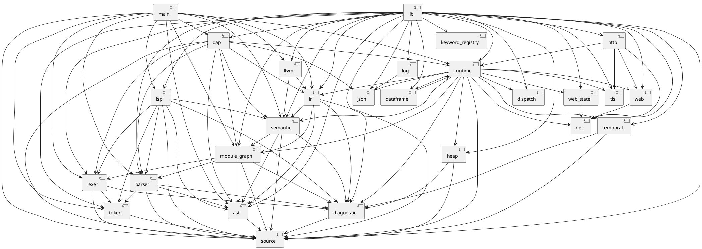

# Basic Next - Componentes do Compilador/Interpretador

Este diretório contém os componentes principais da linguagem Basic Next.

## Arquivos e Funções

* `main.rs`: CLI, ponto de entrada principal, comandos de compilação e execução.
* `lib.rs`: Ponto de entrada da biblioteca, exporta e organiza os módulos.
* `ast.rs`: Definições da Árvore Sintática Abstrata (Abstract Syntax Tree).
* `lexer.rs`: Análise léxica, converte o código fonte em tokens.
* `token.rs`: Definições de tokens utilizados pelo lexer e parser.
* `parser.rs`: Análise sintática, converte tokens na AST.
* `semantic.rs`: Análise semântica, verificação de tipos e modelo semântico.
* `ir.rs`: Definição e geração da Representação Intermediária (Intermediate Representation).
* `llvm.rs`: Backend LLVM para compilação.
* `runtime.rs`: Motor de execução, interpretador e ambiente de runtime.
* `heap.rs`: Gerenciamento de memória e alocação de heap para o interpretador.
* `dispatch.rs`: Resolução de métodos e despacho dinâmico.
* `source.rs`: Gerenciamento de arquivos fonte, caminhos e mapeamento de posições (spans).
* `module_graph.rs`: Resolução de módulos e grafo de dependências.
* `diagnostic.rs`: Formatação de diagnósticos e reporte de erros.
* `keyword_registry.rs`: Registros e consultas de palavras-chave da linguagem.
* `lsp.rs`: Implementação do Language Server Protocol (suporte a IDEs).
* `dap.rs`: Implementação do Debug Adapter Protocol.
* `dataframe.rs`: Implementação de recursos e manipulação de dataframes.
* `temporal.rs`: Funcionalidades de data e tempo.
* `net.rs`: Operações de rede (TCP/UDP).
* `http.rs`: Módulo padrão para cliente e servidor HTTP.
* `web.rs`: Operações relacionadas a web e rotas HTTP.
* `web_state.rs`: Gerenciamento de estado para aplicações web.
* `tls.rs`: Segurança da camada de transporte (Transport Layer Security).
* `json.rs`: Serialização e parsing de JSON.
* `log.rs`: Utilitários de logging.
* `README.md`: Este arquivo.

## Grafo de Dependências

